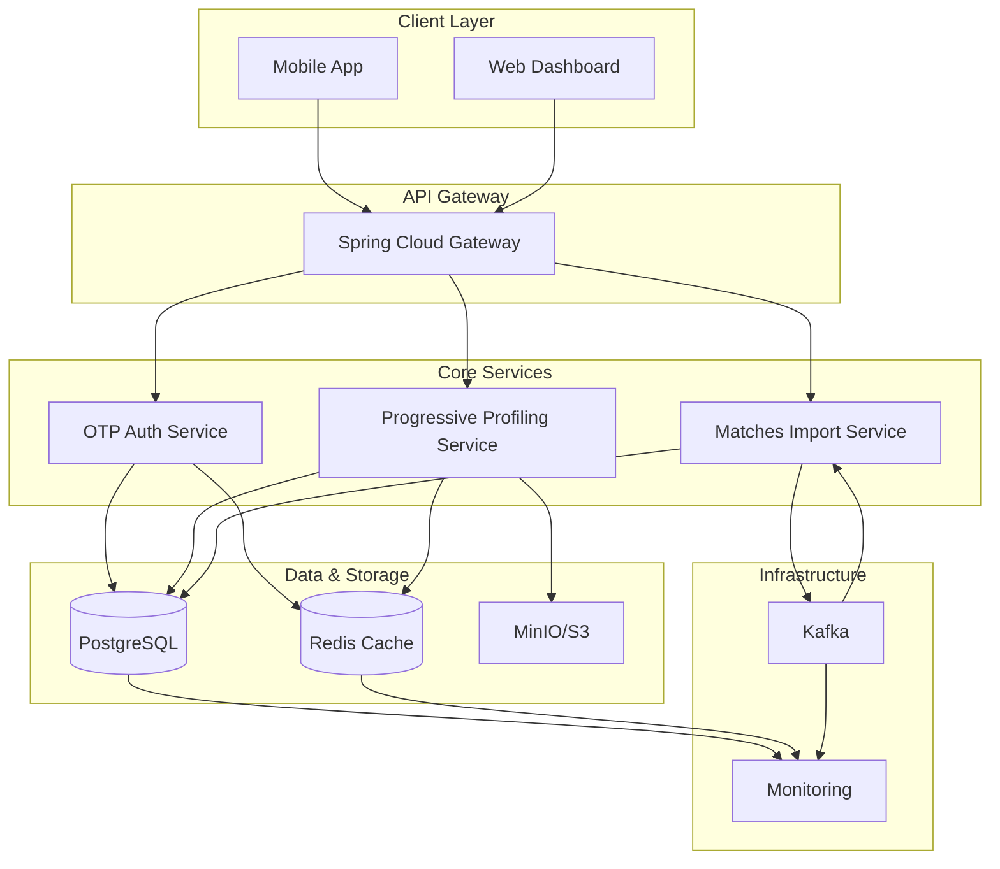
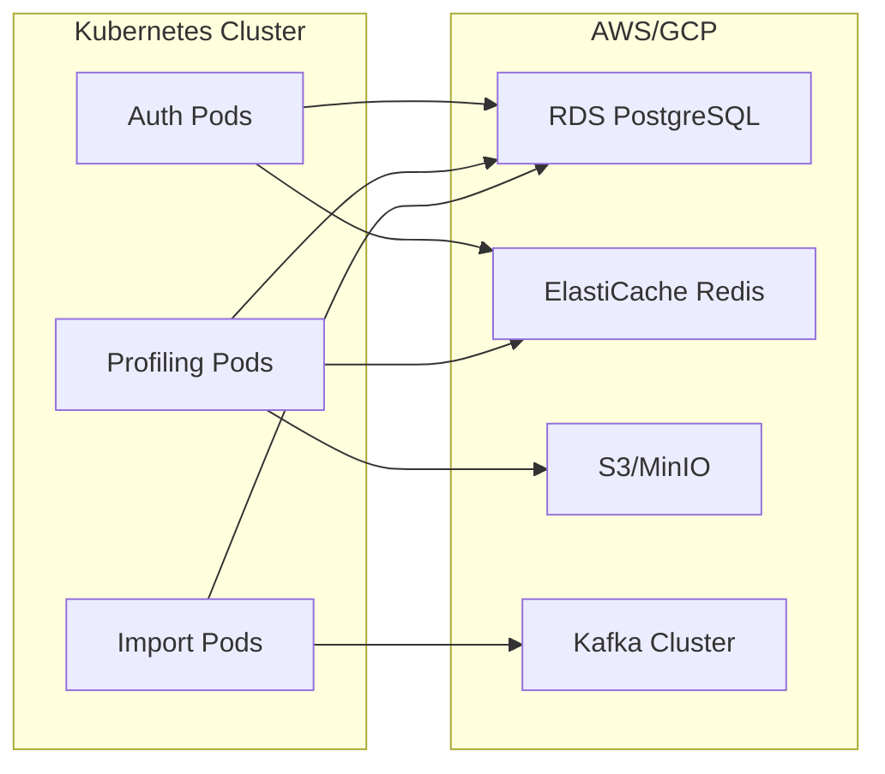

# Dating Platform: High-Level Architecture Overview

## Introduction

A modern, scalable dating platform built with **Spring Boot** that enables passwordless authentication, progressive user profiling, and intelligent match processing. The system processes millions of user profiles and matches daily while ensuring security, performance, and seamless user experience.

---

## System Architecture

---

## Authentication Service (OTP-Based)

**Key Features:**
- Passwordless login via email OTP
- Automatic user creation for new users
- JWT-based session management
- Rate limiting (3 requests/30s per email)
- 5-minute OTP expiration

**Tech Stack:**
- Spring Security with JWT (RSA-signed)
- Redis for OTP caching
- JavaMailSender for email delivery

---

## Progressive Profiling Service

**Key Features:**
- Multi-intent profiles (e.g., Dating, Marriage)
- Modular profile sections (education, lifestyle, etc.)
- Media upload with cloud storage
- Real-time profile readiness tracking
- Intent-based matching groups

**Tech Stack:**
- Spring Data JPA with PostgreSQL
- Redis for caching
- MinIO/S3 for media storage
- OpenAPI documentation

---

## Matches Import Service

**Key Features:**
- High-throughput match ingestion (50M+ daily)
- Parquet file processing
- Batch database inserts (PostgreSQL COPY)
- Kafka-based job orchestration
- Real-time status tracking

**Tech Stack:**
- Project Reactor for streaming
- Kafka for messaging
- PostgreSQL binary COPY
- Micrometer metrics

---

## Technology Stack

| Layer | Technologies |
|-------|--------------|
| **Backend** | Java 17, Spring Boot, Spring Security |
| **Database** | PostgreSQL, Redis |
| **Storage** | MinIO/AWS S3 |
| **Messaging** | Apache Kafka |
| **Monitoring** | Prometheus, Grafana, ELK |
| **Deployment** | Docker, Kubernetes |

---

## Scalability & Performance

- **Horizontal Scaling**: Stateless services with Kubernetes
- **Caching**: Redis for hot data (OTP, profiles)
- **Batch Processing**: Efficient bulk operations (10K+ records/sec)
- **Async I/O**: Non-blocking operations for high throughput
- **Optimized DB**: Partitioned tables, connection pooling

---

## Security Highlights

- **Zero-Trust Auth**: JWT with RSA signing
- **Data Encryption**: TLS in transit, at rest encryption
- **Rate Limiting**: Prevents brute-force attacks
- **Audit Logging**: Structured logs for compliance
- **Input Validation**: Comprehensive request validation

---

## Monitoring & Observability

- **Metrics**: Micrometer + Prometheus
- **Tracing**: OpenTelemetry
- **Logging**: Structured JSON (Logback)
- **Alerts**: PagerDuty integration for failures
- **Health Checks**: Spring Boot Actuator

---

## Deployment Architecture

---

## Key Innovations

1. **Intent-Based Profiles**: Users maintain separate personas for different goals
2. **Reactive Match Processing**: Stream millions of matches without memory issues
3. **Smart OTP Caching**: Redis-based rate limiting and expiration
4. **Binary DB Inserts**: 10x faster match ingestion with PostgreSQL COPY

---

## Impact & Scale

| Metric | Daily Volume |
|--------|--------------|
| Authentication Requests | 500K+ |
| Profile Updates | 100K+ |
| Matches Processed | 50M+ |
| Media Uploads | 10K+ |
| API QPS | 1K+ |

---

## Future Roadmap

- AI-powered profile suggestions
- GraphQL API for flexible queries
- Multi-region deployment
- Real-time collaboration features

---

