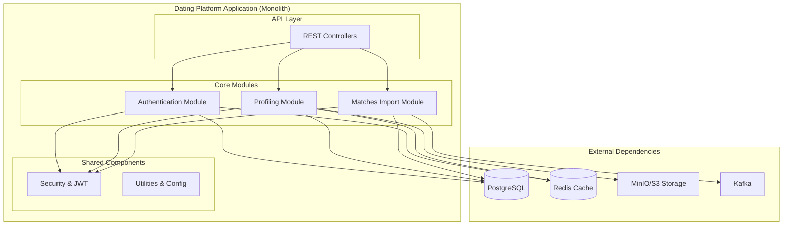
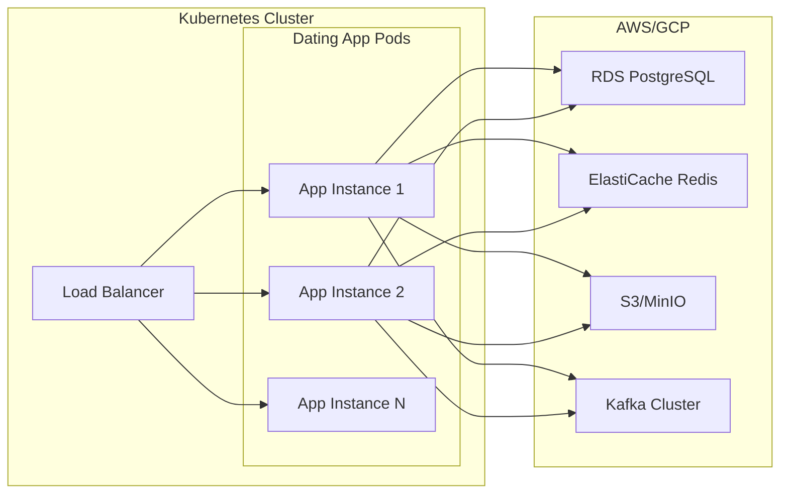

# Dating Platform

## Introduction

A modern, scalable dating platform built as a **single Spring Boot application** with a clear **module-based architecture**. This design combines the operational simplicity of a monolith with the organizational benefits of well-defined, loosely-coupled modules, making it easy to develop, deploy, and maintain.

---

## System Architecture

The application is a cohesive unit but is internally organized into distinct modules, each with a specific responsibility.

---

## Authentication Module

Handles secure, passwordless user access.

*   **Features:**
    *   Email-based OTP login.
    *   Automatic user provisioning.
    *   JWT session management.
    *   Rate limiting & OTP expiration.
*   **Internals:** Uses Spring Security, Redis for OTP caching, and a `JavaMailSender`.

---

## Progressive Profiling Module

Manages the entire user profile lifecycle.

*   **Features:**
    *   Multi-intent profiles (e.g., Dating, Marriage).
    *   Modular profile sections (Education, Lifestyle, etc.).
    *   Media upload to cloud storage.
    *   Readiness tracking for matching.
*   **Internals:** Uses Spring Data JPA, Redis for caching profiles, and integrates with MinIO/S3.

---

## Matches Import Module

A high-throughput, asynchronous module for ingesting match suggestions.

*   **Features:**
    *   Processes large Parquet files from an external matching engine.
    *   Uses reactive streaming for memory efficiency.
    *   Performs fast batch inserts into PostgreSQL.
    *   Tracks job status via Kafka.
*   **Internals:** Built with Project Reactor, Kafka for job orchestration, and PostgreSQL's `COPY` command.

---

## Technology Stack

| Category | Technologies |
|----------|--------------|
| **Backend** | Java 17, Spring Boot, Spring Security, Project Reactor |
| **Database** | PostgreSQL, Redis |
| **Storage** | MinIO / AWS S3 |
| **Messaging** | Apache Kafka |
| **Monitoring** | Prometheus, Grafana, ELK Stack |
| **Deployment** | Docker, Kubernetes |

---

## Why a Modular Monolith?

This architecture was chosen to balance development speed with long-term maintainability.

*   **Simplicity:** Single unit to deploy, test, and manage.
*   **Performance:** In-module communication is fast, in-process calls.
*   **Transactional Integrity:** Easy to manage ACID transactions across modules.
*   **Clear Boundaries:** Modules are well-defined, making the codebase organized and easy to understand.
*   **Future-Proof:** Modules can be extracted into microservices later if needed, without a major rewrite (Strangler Fig pattern).

---

## Scalability & Performance

The application is designed to scale horizontally by running multiple instances behind a load balancer.

*   **Stateless Design:** JWT authentication and stateless modules allow for easy scaling.
*   **Efficient Caching:** Redis reduces database load for hot data like OTPs and user profiles.
*   **Asynchronous Processing:** The Matches Import module uses reactive streams to handle large data volumes without blocking threads.
*   **Optimized Database:** Uses efficient batch processing and database partitioning.

---

## Security Highlights

*   **Zero-Trust Auth:** JWT with RSA signing for API security.
*   **Data Encryption:** All data is encrypted in transit (TLS) and at rest.
*   **Rate Limiting:** Prevents abuse on sensitive endpoints like OTP generation.
*   **Input Validation:** Comprehensive validation to prevent injection attacks.

---

## Monitoring & Observability

*   **Metrics:** Collected via Micrometer and visualized in Prometheus/Grafana.
*   **Logging:** Structured JSON logs for easy parsing and analysis.
*   **Health Checks:** Spring Boot Actuator provides liveness and readiness probes.
*   **Alerting:** Configured alerts for high error rates or processing failures.

---

## Deployment Architecture

The entire application is packaged and deployed as a single service.

---

## Impact & Scale

| Metric | Daily Volume |
|--------|--------------|
| Authentication Requests | 500K+ |
| Profile Updates | 100K+ |
| Matches Processed | 50M+ |
| Media Uploads | 10K+ |
| API QPS | 1K+ |

---

## Future Roadmap

*   **AI-Powered Suggestions:** Enhance profiles with smart recommendations.
*   **GraphQL API:** Provide a more flexible API for clients.
*   **Module Extraction:** Gradually extract modules like `Matches Import` into microservices as load and team size grow.

---

