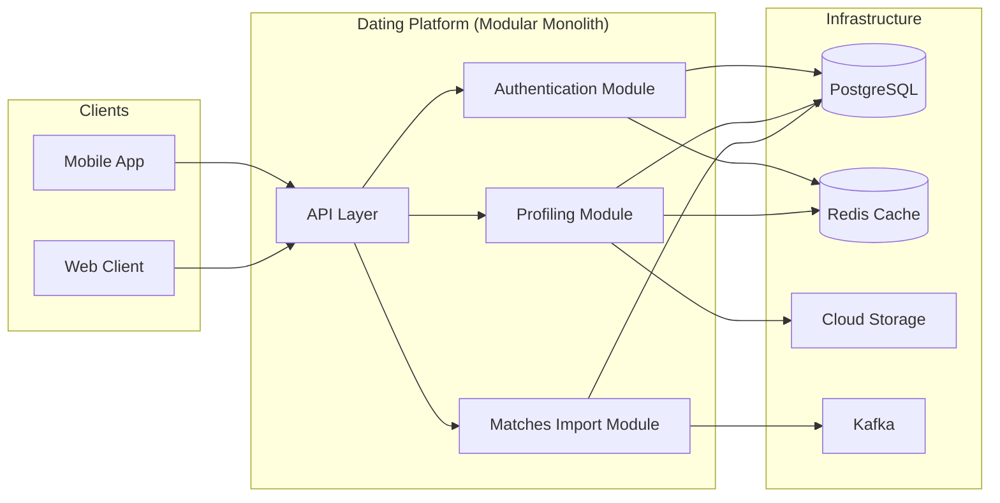

# Dating Platform

## Introduction

A pre-deployment design for a modern, scalable dating platform built as a **single Spring Boot application** with a clear **module-based architecture**. This design combines the operational simplicity of a monolith with the organizational benefits of well-defined, loosely-coupled modules, ensuring rapid development and future maintainability.

---

## Architecture Overview

The system is designed as a single deployable unit, internally organized into three core modules. This approach simplifies deployment, testing, and transaction management while maintaining a clean separation of concerns.

---

## Core Modules

### Authentication Module
Handles secure, passwordless user access.
*   **Features:** Email OTP login, automatic user creation, JWT session management, rate limiting.
*   **Tech:** Spring Security, Redis (OTP cache), JavaMailSender.

### Profiling Module
Manages the entire user profile lifecycle.
*   **Features:** Multi-intent profiles (e.g., Dating, Marriage), modular profile sections, media uploads, readiness tracking for matching.
*   **Tech:** Spring Data JPA, Redis (profile cache), MinIO/S3.

### Matches Import Module
A high-throughput module for ingesting match suggestions.
*   **Features:** Processes large files from an external matching engine, reactive streaming, fast batch inserts, job status tracking.
*   **Tech:** Project Reactor, Kafka (job orchestration), PostgreSQL `COPY`.

---

## Technology Stack

| Category | Technologies |
|----------|--------------|
| **Backend** | Java 17, Spring Boot, Spring Security |
| **Database** | PostgreSQL, Redis |
| **Storage** | MinIO / AWS S3 |
| **Messaging** | Apache Kafka |
| **Monitoring** | Prometheus, Grafana, ELK Stack |
| **Deployment** | Docker, Kubernetes |

---

## Key Architectural Decisions

*   **Modular Monolith:** Chosen for simplicity in early-stage development. It offers fast in-process communication and easy transaction management while keeping the codebase organized. Modules are designed to be easily extractable into microservices in the future.
*   **Stateless Design:** The application is stateless, enabling horizontal scaling by simply running more instances behind a load balancer.
*   **Asynchronous Processing:** Heavy-duty tasks like match importing are handled asynchronously to prevent blocking user-facing operations.

---

## Scalability & Performance

The architecture is designed for high throughput and low latency.

*   **Horizontal Scaling:** Stateless services allow for running multiple instances.
*   **Efficient Caching:** Redis is used to reduce database load for hot data like user profiles and OTPs.
*   **Batch Processing:** The Matches Import module is optimized for bulk database operations, designed to process millions of records efficiently.

---

## Security Highlights

*   **Zero-Trust Auth:** JWT with RSA signing for API security.
*   **Data Encryption:** All data is encrypted in transit (TLS) and at rest.
*   **Rate Limiting:** Prevents abuse on sensitive endpoints like OTP generation.
*   **Input Validation:** Comprehensive validation to prevent injection attacks.

---
