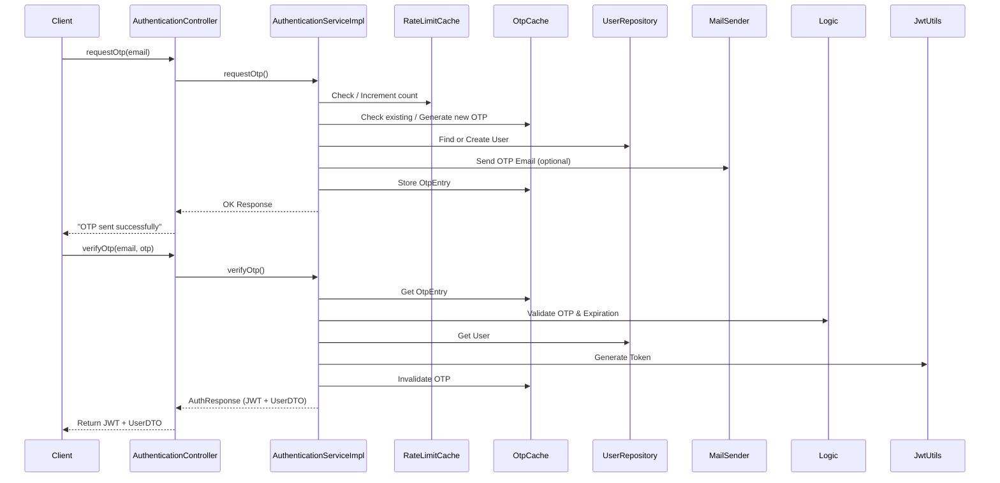

## High-Level Design: OTP-Based Authentication System

### 1. Overview
This document outlines the high-level architecture for an OTP (One-Time Password) based user authentication module in a Spring Boot application. The system enables passwordless login via email OTP, with automatic user creation for new users, rate limiting to prevent abuse, and JWT (JSON Web Token) issuance for session management. It integrates with email services for OTP delivery and uses caching for OTP storage and rate limiting.

**Key Goals:**
- Secure, stateless authentication without passwords.
- Handle user onboarding (create user if not exists).
- Prevent spam/abuse via rate limiting and OTP expiration.
- Secure subsequent API calls using JWT tokens.
- Scalable and fault-tolerant (e.g., via caching and exception handling).

**Assumptions:**
- Backend is a RESTful API serving web/mobile clients.
- External dependencies: Email service (e.g., SMTP via JavaMailSender), Database (e.g., JPA with repositories), Caching (e.g., Caffeine or Redis).
- Security: RSA-based JWT signing for integrity and non-repudiation.
- Non-functional: OTP validity = 5 minutes; Rate limit = 3 requests per 30 seconds per email.

### 2. System Components
The system is modular, following Spring Boot conventions (Controllers, Services, Repositories, Filters, Utilities).

- **API Layer (Controllers):**
    - Exposes REST endpoints under `/auth` for OTP request and verification.
    - Uses OpenAPI/Swagger annotations for documentation.

- **Business Logic Layer (Services):**
    - `AuthenticationService`: Core logic for OTP generation, validation, user management, and JWT issuance.
    - `JwtUtils`: Handles JWT creation, parsing, and validation using Nimbus JOSE + JWT library.
    - Integrates with repositories for user/role persistence and email sender for OTP delivery.

- **Data Layer:**
    - `UserRepository` and `RoleRepository`: JPA-based for user and role CRUD (e.g., find by email, save user).
    - Caches:
        - `otpCache`: Stores OTP entries (key: email, value: OtpEntry with OTP and timestamp).
        - `rateLimitCache`: Tracks request counts (key: email, value: AtomicInteger).

- **Security Layer:**
    - `AuthTokenFilter`: OncePerRequestFilter for JWT validation on protected endpoints.
    - `JwtAuthenticationEntryPoint`: Handles authentication failures (e.g., invalid/expired tokens).
    - Spring Security integration: Sets authentication in SecurityContextHolder for authorized requests.

- **External Integrations:**
    - `JavaMailSender`: Sends OTP emails (currently commented in code; can be enabled).
    - RSA Key Pair: For JWT signing/verification (injected via `JwtUtils`).

- **Cross-Cutting Concerns:**
    - Logging: SLF4J for audit trails (e.g., OTP generation).
    - Validation: `@Valid` on requests; Custom exceptions (e.g., `BadCredentialsException`).
    - Error Handling: `ResponseStatusException`, `ErrorUtility` for JSON error responses.

### 3. High-Level Data Flow
```mermaid
flowchart TB

%% --- OTP Request Flow ---
subgraph OTP_Request["POST /auth/request-otp"]
  A1[Client Request] --> B1[AuthenticationController]
  B1 --> C1[AuthenticationServiceImpl]
  C1 --> D1[Validate request<br/>(email, notification flag)]
  D1 --> E1[Check rate limit (cache)]
  E1 --> F1[Find or create user<br/>(repository)]
  F1 --> G1[Generate OTP<br/>and cache with timestamp]
  G1 --> H1[Send email<br/>(if enabled)]
  H1 --> I1[Response:<br/>"OTP sent successfully"]
end

%% --- OTP Verification Flow ---
subgraph OTP_Verify["POST /auth/verify-otp"]
  A2[Client Request] --> B2[AuthenticationController]
  B2 --> C2[AuthenticationServiceImpl]
  C2 --> D2[Retrieve OTP from cache]
  D2 --> E2[Validate OTP match<br/>and expiration (5 min)]
  E2 --> F2[Invalidate OTP cache]
  F2 --> G2[Fetch user (repository)]
  G2 --> H2[Generate JWT (JwtUtils)]
  H2 --> I2[Response:<br/>AuthResponse (JWT + UserDTO)]
end

%% --- Protected Request Flow ---
subgraph Protected_Request["GET /api/data (Protected Endpoint)"]
  A3[Client Request<br/>Authorization: Bearer JWT] --> B3[AuthTokenFilter<br/>(Spring Filter Chain)]
  B3 --> C3[Extract token and username<br/>from header]
  C3 --> D3[Validate JWT<br/>(signature, expiration, username)]
  D3 --> E3[Load UserDetails<br/>(UserDetailsServiceImpl)]
  E3 --> F3[Set Authentication<br/>in SecurityContextHolder]
  F3 --> G3[Proceed to Controller<br/>if authenticated]
  D3 -.-> X3[Invalid Token] -.-> Y3[JwtAuthenticationEntryPoint<br/>401/403 Error]
end

```

**Sequence Diagram (Textual Representation):**



### 4. Key Interactions and Dependencies
- **Inbound:** REST clients (e.g., mobile app) via HTTP/JSON.
- **Outbound:** Email SMTP; Database queries.
- **Internal Flows:**
    - User Creation: On first OTP request, auto-creates user with default role.
    - Rate Limiting: Per-email counters reset implicitly via cache TTL (not shown; assume configured).
    - JWT Lifecycle: 1-hour expiration; Roles embedded in claims for authorization.
- **Error Scenarios:**
    - Rate limit exceeded: 429 Too Many Requests.
    - Invalid/Expired OTP: 401 Bad Credentials.
    - Auth Failure: 401 Unauthorized or 403 Forbidden.
    - Internal: 500 with JSON error details.

### 5. Scalability and Security Considerations
- **Scalability:** Stateless (JWT); Caches for low-latency OTP checks; Horizontal scaling via load balancers (shared cache if distributed).
- **Security:**
    - OTP: Short-lived, hashed in cache? (Code uses plain; recommend hashing).
    - JWT: RSA-signed, no symmetric keys; Claims include roles for RBAC.
    - Rate Limiting: Prevents brute-force.
    - HTTPS: Assumed for all traffic.
    - Vulnerabilities: Mitigate CSRF (Spring Security), SQL injection (JPA), Email spoofing (DKIM/SPF).
- **Monitoring:** Logs for OTP events; Metrics for request rates (integrate with Micrometer/Prometheus).

### 6. Deployment Notes
- Spring Boot Actuator for health checks.
- Config: `application.yml` for mail, cache TTL, RSA keys.
- Testing: Unit (Mockito for services), Integration (Testcontainers for DB/Mail).

---

