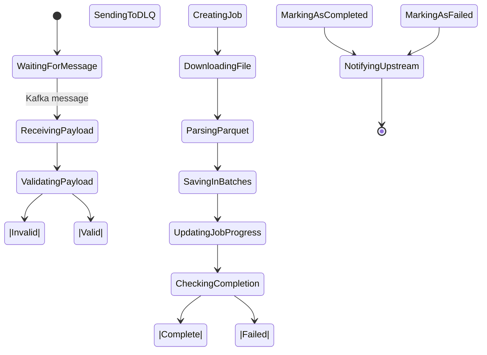

# **High-Level Design (HLD): Matches Import Module**

---

## 1. **Objective**

Enable the dating app to:
- Receive **match suggestions** generated by a machine learning or rules-based engine
- Ingest large volumes of matches (up to millions per day)
- Store them efficiently in the database
- Make them available for user-facing features like:
    - “Top Picks”
    - “Daily Matches”
    - “Who Likes You?”
- Track job status and notify downstream systems

Supports **high throughput**, **fault tolerance**, and **observability**.

---

## 2. **System Context Diagram**

```mermaid
graph TD
    A[Matching Engine (FlairBit)] -->|Sends Match File| B[Kafka Topic]
    B --> C[Matches Import Module]
    C --> D[(PostgreSQL DB)]
    C --> E[Kafka Status Topic]
    F[User App] <---> G[Match Retrieval API]
    G --> D
    H[Monitoring] <--- C
    I[Logging] <--- C

    style C fill:#2196F3,stroke:#1976D2,color:white
    style D fill:#4CAF50,stroke:#388E3C,color:white
    style B fill:#9C27B0,stroke:#7B1FA2,color:white
    style E fill:#FF9800,stroke:#F57C00,color:white
```

### External Systems
| System | Role |
|-------|------|
| **Matching Engine (FlairBit)** | Generates match recommendations as Parquet files |
| **Kafka** | Message broker: sends file metadata & receives status updates |
| **PostgreSQL** | Stores imported match suggestions |
| **User App / API Layer** | Queries matches for display to users |
| **Monitoring (Prometheus/Grafana)** | Observes latency, errors, throughput |
| **Logging (ELK/Datadog)** | Audits processing steps |

---

## 3. **Core Components Overview**

| Component | Responsibility |
|--------|----------------|
| **Kafka Consumer** | Listens to topic pattern; triggers import on message |
| **Payload Processor** | Parses incoming JSON, validates structure |
| **Import Job Service** | Creates tracking job, downloads file, starts processing |
| **Parquet Parser** | Streams records from `.parquet` without loading entire file |
| **Batch Processor** | Buffers suggestions and saves in batches |
| **Storage Engine** | Uses `COPY FROM STDIN BINARY` + upsert to PostgreSQL |
| **Job Repository** | Tracks progress: PENDING → PROCESSING → COMPLETED/FAILED |
| **Status Notifier** | Sends completion/failure event back to Kafka |
| **DLQ Handler** | Dead-letter queue for invalid/malformed messages |

---

## 4. **Service Boundaries**

This module is part of the **Progressive Profiling Service**, but acts as a **dedicated data pipeline consumer**.

```
+----------------------------+
|   Dating Platform          |
|                            |
| +------------------------+ |
| | Progressive Profiling  | ← This Module Lives Here
| |   - Profile Management | 
| |   - Media Upload       |
| |   - Matches Import   |
| +------------------------+ |
|                            |
| +------------------------+ |
| | Matching Engine        | ← Produces match suggestions
| +------------------------+ |
|                            |
| +------------------------+ |
| | User Facing Services   | ← Consumes stored matches
| +------------------------+ |
+----------------------------+
```

**Ownership**: Owns ingestion logic, job tracking, and storage optimization.

**Does NOT own**: Matching logic, UI, authentication, or long-term analytics.

---

## 5. **Integration Points**

| Integration | Protocol | Direction | Purpose |
|-----------|---------|----------|--------|
| **Kafka (Input)** | TCP | Inbound | Receive match suggestion file metadata |
| **Kafka (Output)** | TCP | Outbound | Notify job success/failure |
| **PostgreSQL** | JDBC | Bidirectional | Store matches + track job state |
| **HTTP/S3** | HTTPS | Inbound | Download Parquet file from cloud storage |
| **Monitoring (Prometheus)** | HTTP | Outbound | Expose metrics |
| **Logging (ELK/Datadog)** | TCP/HTTP | Outbound | Ship structured logs |

---

## 6. **Data Flow Overview**

```mermaid
flowchart LR
    K[Kafka: Match Suggestion Event] --> C{Consumer}
    C --> V[Validate Payload]
    V -->|Invalid| DLQ[Send to DLQ]
    V -->|Valid| J[Create Import Job (PENDING)]
    J --> F[Download Parquet File]
    F --> P[Parse Stream → MatchSuggestions]
    P --> B[Buffer into Batches]
    B --> S[Save Batch to DB via COPY + UPSERT]
    S --> U[Update Job Progress]
    U --> N{More Batches?}
    N -->|Yes| B
    N -->|No| X[Mark Job COMPLETED]
    X --> T[Send Status to Kafka]
    E[Failure Anywhere] --> Y[Mark Job FAILED]
    Y --> T

    style DLQ fill:#F44336,stroke:#D32F2F,color:white
    style T fill:#4CAF50,stroke:#388E3C,color:white
    style Y fill:#FF9800,stroke:#F57C00,color:white
```

> All operations are **asynchronous**
> Uses **reactive streaming** to avoid OOM with large files
> Leverages **binary COPY** for fastest possible insert performance

---

## 7. **Key Architectural Decisions**

| Decision | Rationale |
|--------|---------|
| **Reactive Processing (Project Reactor)** | Handle large files without memory pressure |
| **Binary COPY INTO Temp Table** | Fastest way to load data into PostgreSQL |
| **Upsert via Temp Table** | Avoid duplicates during concurrent imports |
| **Job-Based Tracking** | Enables monitoring, retry, audit trail |
| **Kafka for Orchestration** | Decouples producer and consumer; supports replay |
| **DLQ for Invalid Messages** | Isolate bad data without stopping pipeline |
| **Retryable Batch Inserts** | Survive transient DB issues |
| **Graceful Shutdown Support** | Prevent data loss during deployment |
| **Micrometer Metrics** | Monitor duration, success rate, volume |

---

## 8. **Scalability & Performance**

### Expected Scale
| Metric | Estimate |
|-------|----------|
| Daily Match Suggestions | Up to 50M |
| Files Per Day | 5–20 |
| Avg File Size | 100 MB – 1 GB (Parquet) |
| Import Frequency | Continuous (streaming) or daily batch |
| Target Throughput | > 100K matches/sec |
| Max Latency | < 2 hours from generation to availability |

### Optimization Strategies
| Area | Strategy |
|------|---------|
| **Read Efficiency** | Stream Parquet instead of loading fully |
| **Write Efficiency** | Use `COPY FROM STDIN BINARY` + temp table |
| **Concurrency** | Multiple Kafka consumers (`concurrency=4`) |
| **Threading Model** | Dedicated I/O executor pool |
| **DB Tuning** | `synchronous_commit=OFF`, connection pooling |
| **Memory Safety** | Buffer limits, timeouts, reactive backpressure |

---

## 9. **Deployment Architecture**


### Tech Stack
| Layer | Technology |
|------|------------|
| **Runtime** | Java 17 + Spring Boot |
| **Containerization** | Docker |
| **Orchestration** | Kubernetes (EKS/GKE) |
| **Database** | PostgreSQL (RDS/Aurora) |
| **Messaging** | Kafka (Confluent Cloud or self-hosted) |
| **Storage** | AWS S3 / GCS (for Parquet files) |
| **Monitoring** | Prometheus + Grafana |
| **Logging** | ELK Stack or Datadog |
| **CI/CD** | GitHub Actions / Jenkins |

---

## 10. **Security & Compliance**

| Aspect | Implementation |
|-------|----------------|
| **Data in Transit** | TLS for Kafka, HTTPS for S3, encrypted JDBC |
| **Data at Rest** | Encrypted DB volumes, S3 buckets |
| **Authentication** | IAM roles, Kafka SASL, service accounts |
| **Authorization** | Least privilege access |
| **Audit Logs** | Structured logs include `jobId`, `groupId`, `timestamp` |
| **PII Handling** | Only usernames/participant IDs stored |
| **Domain Isolation** | `domainId` ensures multi-tenancy safety |

---

## 11. **Data Lifecycle**



>  **TTL Policy**: Old jobs archived after 30 days.

---

## 12. **Observability**

### Metrics (Micrometer)
| Metric | Type | Tags | Use |
|-------|------|------|-----|
| `match_suggestions_storage_duration` | Timer | `groupId` | End-to-end save time |
| `match_suggestions_storage_batch_duration` | Timer | `groupId` | Per-batch latency |
| `match_suggestions_storage_matches_saved_total` | Counter | `groupId` | Volume tracking |
| `match_suggestions_storage_errors_total` | Counter | `groupId`, `error_type` | Alert on failure |
| `kafka_consumer_errors_total` | Counter | `topic` | Detect consumer issues |
| `import_job_duration_seconds` | Timer | `status` | SLA monitoring |

### Logging
- INFO: Job start/end, batch sizes, total saved
- DEBUG: Individual batch logs
- ERROR: Full stack trace on critical failures

### Alerts
- `match_suggestions_storage_errors_total > 0` → PagerDuty
- `job duration > 2h` → Warning
- No jobs processed for 2 days → Critical

---

## 13. **Reliability & Resilience**

| Risk | Mitigation |
|------|-----------|
| Transient DB Failure | Retry with backoff (`@Retryable`) |
| Network Timeout Downloading File | Fail fast, send FAILED status |
| Corrupted Parquet File | Let parser fail, mark job failed |
| OOM During Processing | Reactive streaming prevents full load |
| Clock Skew | Use UTC internally |
| Service Restart Mid-Job | Job remains in PENDING/PROCESSING → can be resumed manually or retried |

---

## 14. **Roadmap & Future Enhancements**

| Feature | Priority | Benefit |
|--------|----------|--------|
| Checkpointing / Resume | High | Survive crashes without reprocessing |
| Schema Validation | Medium | Catch format changes early |
| Multi-file Imports | Medium | Handle sharded outputs |
| Web Dashboard for Jobs | Low | Visibility for ops team |
| Alert on Low Match Count | Low | Detect engine degradation |
| Exporter Health Probe | Future | `/actuator/health` integration |
| Parallel Group Imports | Future | Speed up multi-group jobs |


---
