# **High-Level Design (HLD): Progressive Profiling System**


---

## 1. **Objective**

Enable **progressive onboarding** where users:
- Start with minimal information
- Gradually enrich their profile over time
- Can maintain **multiple personas per intent** (e.g., “Casual Dating”, “Marriage”)
- Upload media and set preferences
- Become eligible for matching when complete

Supports high engagement, better UX, and personalized matchmaking.

---

## 2. **System Context Diagram**


### External Systems
| System | Interaction |
|-------|-------------|
| **Mobile/Web App** | Primary client; calls REST APIs |
| **Auth Service** | Provides JWTs; verifies identity |
| **Matching Engine** | Reads `UserMatchState` to find candidates |
| **Analytics Pipeline** | Consumes profile events for insights |
| **Notification Service** | Notifies user when matched |
| **Cloud Storage** | Stores uploaded photos/videos |

---

## 3. **Core Components**

| Component | Responsibility |
|--------|----------------|
| **Profile Management API** | CRUD for profile sections (education, lifestyle, etc.) |
| **Media Upload & Retrieval** | Handle photo/video uploads, serve reels |
| **Intent Router** | Routes requests by `intent` (e.g., DATING, MARRIAGE) |
| **Cache Layer** | Caches fully built `Profile` objects for fast reads |
| **Group Config Resolver** | Maps `intent` → `groupId` for matching groups |
| **Third-Party Connectors** | Abstracts cloud storage providers |
| **Database** | Stores all user and profile data |

---

## 4. **Service Boundaries**

This system is a **bounded context** within a larger dating platform:

```
+----------------------------+
|   Dating Platform          |
|                            |
| +------------------------+ |
| | Progressive Profiling  | ← This Service (Microservice)
| +------------------------+ |
|                            |
| +------------------------+ |
| | Matching Engine        | 
| +------------------------+ |
|                            |
| +------------------------+ |
| | Messaging              |
| +------------------------+ |
+----------------------------+
```

**Ownership**: Owns `profiles`, `user_match_states`, `media_files`, and related entities.

**Does NOT own**: Authentication, payments, chat, push notifications.

---

## 5. **API Surface (REST Endpoints)**

All APIs follow pattern:
```
/users/{email}/{section}/{intent}
```

| Section | Method | Purpose |
|--------|--------|--------|
| `/profile` | `PUT` | Create/update basic profile |
| `/education` | `GET/PUT` | Manage degree, institution |
| `/lifestyle` | `GET/PUT` | Drinking, smoking, religion |
| `/location` | `GET/PUT` | City, country, coordinates |
| `/profession` | `GET/PUT` | Job title, company, industry |
| `/preferences` | `GET/PUT` | Age range, gender prefs, kids |
| `/media/upload` | `POST` | Upload photos/videos |
| `/media/user-reels` | `GET` | Get user’s reels |
| `/media/matched-users-reels` | `GET` | Feed of other users’ reels |

> All support `intent` parameter → enables multi-profile strategy

---

## 6. **Data Model Overview**

### Key Entities
| Entity | Cardinality | Notes |
|------|------------|-------|
| `User` | 1 per account | Email, username, password (nullable), roles |
| `Profile` | N per user | One per `intent` (e.g., DATING, MARRIAGE) |
| `Education`, `Profession`, etc. | 1:1 with Profile | Optional sections |
| `MediaFile` | 1..N per Profile | Photos/videos; partitioned by time |
| `UserMatchState` | 1:1 with Profile | Tracks readiness for matching |
| `GroupConfig` | Global | Maps `intent` → `groupId` (e.g., "dating-default") |

>  **Multi-intent support** achieved by allowing multiple profiles per user.

---

## 7. ⚙️ **Key Architectural Decisions**

| Decision | Rationale |
|--------|---------|
| **Intent-Based Profiles** | Users may want different personas for different goals (e.g., fun vs serious) |
| **Separate Table per Section** | Enables optional fields, avoids sparse tables |
| **Manual SQL + RowMapper** | Full control over performance; avoids JPA N+1 issues |
| **Spring Cache Abstraction** | Fast reads via Redis; invalidated on writes |
| **Partitioned Media Table** | Scales writes/reads; supports TTL via partition drop |
| **Dispatcher Pattern for External Services** | Pluggable storage (S3, GCS, Azure) |
| **Async Media Feeds** | `CompletableFuture` prevents blocking under load |

---

## 8. **Security & Authorization**

| Layer | Mechanism |
|------|----------|
| **Transport** | HTTPS only |
| **Authentication** | JWT in `Authorization: Bearer <token>` |
| **Authorization** | Should validate that caller owns `{email}` or has admin rights |
| **Input Validation** | `@Valid`, `@NotNull`, custom validators |
| **Rate Limiting** | TBD (e.g., 100 requests/min per user) |
| **Audit Logs** | Log sensitive operations (future enhancement) |

> 🔒 Recommendation: Add `@PreAuthorize("#email == authentication.name")` to all endpoints.

---

## 9. **Scalability & Performance**

### Read/Write Pattern
- **Read-heavy**: Profile views, media feeds
- **Write-light**: Occasional updates per session

### Optimization Strategies
| Area | Strategy |
|------|---------|
| **Profile Reads** | Cache entire `Profile` object using Redis |
| **DB Queries** | Single optimized JOIN query via `JdbcTemplate` |
| **Media Storage** | Offload binaries to cloud storage (S3/GCS) |
| **Media Metadata** | Partitioned table + indexing on `(profile_id, reel_type)` |
| **Caching** | `@Cacheable("profileCache", key="userId_intent")` |
| **Eviction** | `@CacheEvict` after every update |

### Expected Load
| Metric | Estimate |
|-------|----------|
| QPS (Read) | ~500–1000 |
| QPS (Write) | ~50–100 |
| Media Uploads/day | ~10K |
| Active Users | ~1M |

---

## 10. **Deployment Architecture**


### Tech Stack
- **Runtime**: Java 17 + Spring Boot
- **Containerization**: Docker
- **Orchestration**: Kubernetes (EKS/GKE)
- **Database**: PostgreSQL (RDS/Aurora)
- **Cache**: Redis (ElastiCache/Cloud Memorystore)
- **Storage**: AWS S3 / Google Cloud Storage
- **CI/CD**: GitHub Actions / Jenkins
- **Monitoring**: Prometheus + Grafana, ELK or Datadog
- **Tracing**: OpenTelemetry / Jaeger

---

## 11. **Data Flow Examples**

### User Completes Profile → Ready for Matching

```mermaid
sequenceDiagram
    User->>API: PUT /users/john@x.com/preferences/dating
    API->>DB: Save preferences
    API->>Cache: Evict profileCache
    API->>MatchingEngine: Profile complete → trigger match scan
    MatchingEngine->>DB: Query user_match_states WHERE group_id='dating-default' AND ready_for_matching=true
    MatchingEngine->>User: "You have new matches!"
```



### Media Upload Flow


---

## 12. **Observability & Monitoring**

| Area | Tooling |
|------|--------|
| **Logs** | Structured JSON logs (Logback + ELK) |
| **Metrics** | Micrometer + Prometheus |
|   - Cache hit rate | Track `cache.gets`, `cache.hits` |
|   - DB query latency | Monitor slow queries |
|   - Upload throughput | Count successful uploads/sec |
| **Tracing** | OpenTelemetry spans across services |
| **Alerts** | Slack/PagerDuty on error spikes, DB saturation |

---

## 13. **Reliability & Resilience**

| Risk | Mitigation |
|------|-----------|
| Cache Miss Storm | Use cache-aside pattern; limit DB load |
| DB Failure | RDS Multi-AZ; regular backups |
| Storage Outage | Multi-region replication (if needed) |
| Partition Exhaustion | Automate monthly partition creation |
| Schema Drift | Liquibase for versioned migrations |

---

## 14. **Roadmap & Future Enhancements**

| Feature | Priority | Benefit |
|--------|----------|--------|
| Event Publishing (Kafka) | High | Notify downstream systems |
| Profile Completeness Score | High | Drive user engagement |
| GraphQL API | Medium | Flexible queries |
| Soft Deletes | Medium | Recover accidental deletes |
| Admin Dashboard | Low | View profiles, debug issues |
| AI-Based Suggestions | Future | "Add a photo to get more matches!" |

---


