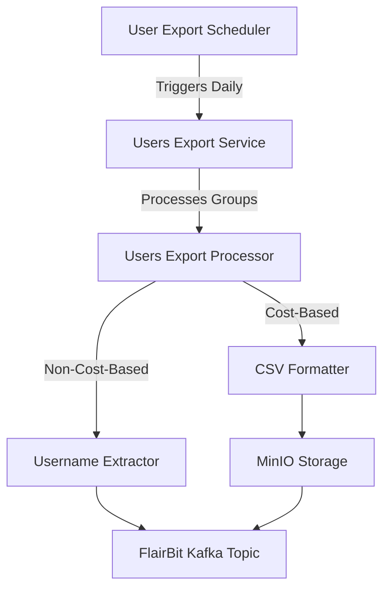
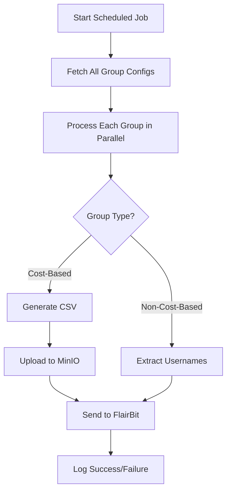
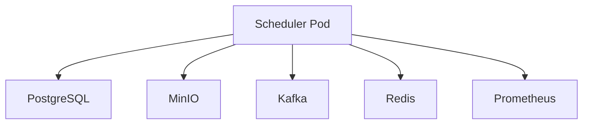

# **High-Level Design (HLD) for User Export Module**

---

## **1. Overview**
The **User Export Module** is a **batch processing system** designed to export user profiles from the dating app to an external matching service (**FlairBit**). It supports **two export formats**:
1. **Cost-Based Export** (CSV format with full user details)
2. **Non-Cost-Based Export** (List of usernames)

The system runs as a **scheduled job** (daily at **11:20 PM IST**) and processes users in **parallel batches** for efficiency.

---

## **2. System Architecture**


### **2.1. Key Components**
| **Component**               | **Responsibility**                                                                 | **Technology**                     |
|-----------------------------|-----------------------------------------------------------------------------------|-----------------------------------|
| **UsersExportScheduler**    | Triggers the export job daily at 11:20 PM IST.                                    | Spring `@Scheduled`, `CompletableFuture` |
| **UsersExportService**      | Orchestrates the export process for each group.                                  | Spring `@Async`, RetryTemplate   |
| **UsersExprtProcessor**     | Fetches users and delegates to the appropriate processor.                        | Spring Data JPA, Batch Processing |
| **CostBasedProcessor**      | Exports users as CSV, uploads to MinIO, and sends to FlairBit.                   | OpenCSV, MinIO SDK                |
| **NonCostBasedProcessor**   | Exports usernames as a list and sends directly to FlairBit.                     | Kafka Producer                   |
| **UsersExportFormatting**   | Generates CSV files or extracts usernames.                                      | OpenCSV, GZIP                    |
| **MinIOUploadService**      | Uploads CSV files to MinIO (S3-compatible storage).                              | MinIO Java SDK                   |
| **FlairBitProducer**        | Sends export payloads to FlairBit via Kafka.                                     | Spring Kafka                     |
| **Monitoring**              | Tracks export duration, failures, and batch processing metrics.                 | Micrometer, Prometheus           |

---

## **3. System Workflow**

### **3.1. High-Level Flow**


### **3.2. Data Flow**
1. **Scheduler** triggers the job daily.
2. **Service** fetches all active group configurations.
3. **Processor** fetches users for each group and delegates to the appropriate processor.
4. **Cost-Based Processor**:
    - Generates a **CSV file** with user details.
    - Uploads to **MinIO**.
    - Sends a **Kafka message** to FlairBit with the file path.
5. **Non-Cost-Based Processor**:
    - Extracts **usernames** from the user list.
    - Sends a **Kafka message** to FlairBit with the usernames.
6. **Monitoring** tracks metrics (duration, failures, batch size).

---

## **4. Key Features**

| **Feature**                     | **Description**                                                                                     |
|--------------------------------|-----------------------------------------------------------------------------------------------------|
| **Scheduled Execution**         | Runs daily at **11:20 PM IST** (`@Scheduled`).                                                      |
| **Parallel Processing**         | Processes multiple groups concurrently using `CompletableFuture`.                                  |
| **Batch Processing**           | Processes users in batches (`batchSize=1000`) to avoid memory issues.                              |
| **Retry Mechanism**             | Retries failed operations (DB queries, Kafka sends) using `RetryTemplate`.                        |
| **Asynchronous I/O**            | Uses `@Async` and `CompletableFuture` for non-blocking operations.                                  |
| **CSV Generation**             | Generates **compressed CSV** files with user details.                                             |
| **MinIO Integration**           | Stores CSV files in **MinIO** (S3-compatible storage).                                             |
| **Kafka Integration**           | Sends export payloads to **FlairBit** via Kafka.                                                   |
| **Metrics & Monitoring**        | Tracks export duration, failures, and batch processing using **Micrometer**.                       |
| **Error Handling**              | Logs failures and increments metrics for observability.                                           |
| **Temporary File Cleanup**      | Automatically cleans up local temp files after upload.                                            |

---

## **5. API & Integration Points**

| **Integration**       | **Method**                          | **Purpose**                                  |
|-----------------------|-------------------------------------|---------------------------------------------|
| **PostgreSQL**        | Spring Data JPA                     | Fetch users to export.                      |
| **MinIO**             | MinIO Java SDK                      | Store exported CSV files.                  |
| **Kafka**             | Spring Kafka                        | Send export payloads to FlairBit.           |
| **Redis**             | Spring Cache                        | Cache group configurations.                 |
| **Micrometer**        | Prometheus Metrics                  | Track export performance.                   |

---

## **6. Data Models**

### **6.1. `UserExportDTO`**
Represents a user to be exported.
```java
public record UserExportDTO(
    String username,
    String groupId,
    String displayName,
    String gender,
    LocalDate dateOfBirth,
    String location,
    String intent,
    String bio,
    Boolean smokes,
    Boolean drinks,
    Boolean wantsKids,
    String education,
    String religion,
    String occupation,
    String preferredGenders,
    Integer preferredMinAge,
    Integer preferredMaxAge,
    String relationshipType,
    Boolean openToLongDistance,
    Boolean readyForMatching
) {}
```

### **6.2. `ExportedFile`**
Represents a successfully exported file.
```java
public record ExportedFile(
    Path localPath,
    String fileName,
    String contentType,
    String groupId,
    UUID domainId,
    String remoteUrl
) {}
```

### **6.3. `NodeExchange` (FlairBit Payload)**
Represents the payload sent to FlairBit.
```java
public record NodeExchange(
    String groupId,
    String filePath,
    String fileName,
    String contentType,
    UUID domainId,
    List<String> usernames
) {}
```

---

## **7. Performance & Scalability**

| **Optimization**               | **Implementation**                                                                 |
|--------------------------------|-----------------------------------------------------------------------------------|
| **Parallel Processing**        | Processes groups in parallel using `CompletableFuture`.                          |
| **Batching**                   | Processes users in batches (`batchSize=1000`).                                   |
| **Asynchronous I/O**           | Uses `@Async` and `CompletableFuture` for non-blocking operations.              |
| **Caching**                    | Caches group configs to reduce DB load.                                          |
| **Compression**                | Uses GZIP to reduce CSV file size.                                               |
| **Retry Mechanism**            | Retries failed operations (DB queries, Kafka sends).                            |
| **Horizontal Scaling**         | Designed to scale with multiple scheduler pods.                                  |

---

## **8. Error Handling & Retries**

| **Scenario**                     | **Recovery Mechanism**                                                                 |
|----------------------------------|---------------------------------------------------------------------------------------|
| **DB Query Failure**             | Retries 3 times, then logs and skips.                                                |
| **CSV Generation Failure**      | Retries, then marks batch as failed.                                                 |
| **MinIO Upload Failure**         | Retries, then logs and increments failure metric.                                   |
| **Kafka Send Failure**           | Retries, then logs and increments failure metric.                                   |
| **Empty Batch**                  | Logs and skips processing.                                                            |
| **Invalid Group Type**           | Logs warning and skips.                                                               |

---

## **9. Monitoring & Observability**

| **Metric**                     | **Description**                                                                 |
|--------------------------------|---------------------------------------------------------------------------------|
| `users_export_duration`       | Time taken to export a group.                                                   |
| `users_export_failures`       | Number of failed exports per group.                                            |
| `users_export_batch_duration` | Time taken to process a batch.                                                  |
| `users_export_csv_processed`  | Number of users exported in CSV format.                                         |
| `users_export_batch_failures`| Number of failed batch processing attempts.                                    |

**Tools Used**:
- **Micrometer** (for metrics collection)
- **Prometheus** (for metrics storage)
- **Grafana** (for visualization)

---

## **10. Security Considerations**

| **Aspect**          | **Implementation**                                                                 |
|---------------------|-----------------------------------------------------------------------------------|
| **Authentication**   | Not applicable (internal job).                                                   |
| **Authorization**   | Only runs in non-test environments (`@Profile("!test")`).                        |
| **Data Encryption** | Files stored in MinIO with access controls.                                     |
| **Audit Logging**   | Logs all export operations with timestamps.                                     |
| **Input Validation**| Validates `domainId` is a UUID, checks for empty batches.                        |

---

## **11. Deployment Architecture**


### **11.1. Scaling Strategy**
| **Component**      | **Scaling Approach**                          |
|--------------------|-----------------------------------------------|
| **Scheduler**      | Horizontal scaling (multiple pods).           |
| **Database**       | Read replicas for `userRepository` queries.  |
| **MinIO**          | Distributed storage with multiple nodes.     |
| **Kafka**          | Partitioned topics for parallel consumption. |

---

## **12. Future Enhancements**

🔹 **Incremental Exports** – Only export changed users since last run.
🔹 **Dynamic Batch Sizing** – Adjust batch size based on system load.
🔹 **Export Resumption** – Resume failed exports from last checkpoint.
🔹 **Multi-Format Support** – Add JSON/Parquet export options.
🔹 **Real-Time Export Triggers** – Export users immediately when marked as `ready_for_matching`.

---

### **Key Takeaways**
- **Asynchronous & Non-Blocking**: Uses `CompletableFuture` and `@Async`.
- **Retry Mechanism**: Ensures reliability with `RetryTemplate`.
- **Modular Design**: Separates concerns (scheduling, processing, formatting).
- **Observability**: Tracks metrics for performance monitoring.
- **Scalable**: Designed for horizontal scaling.

---
