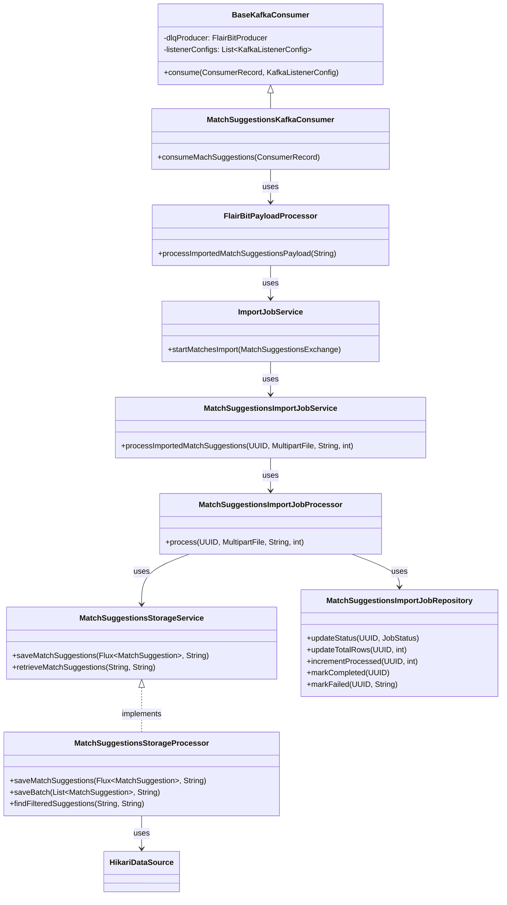
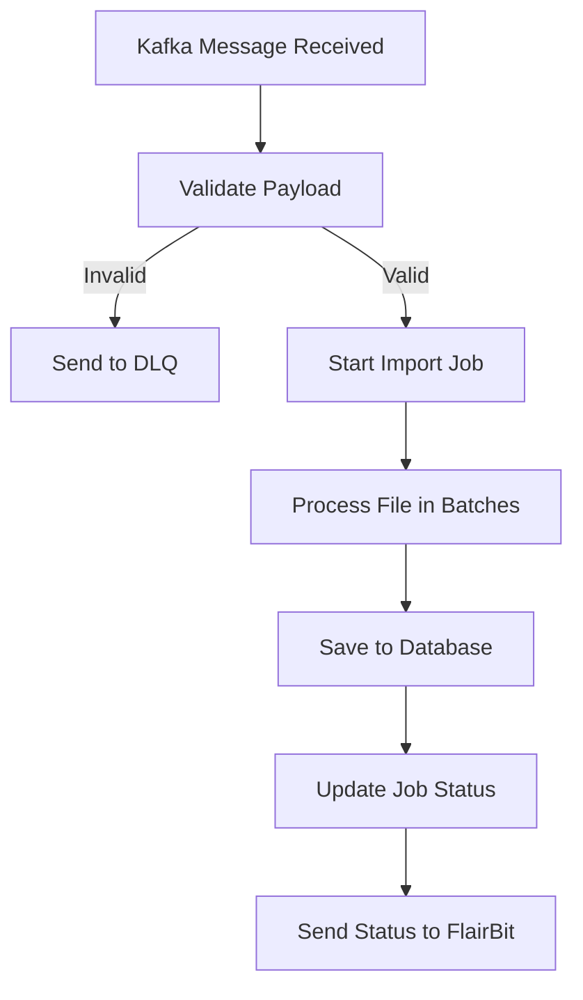
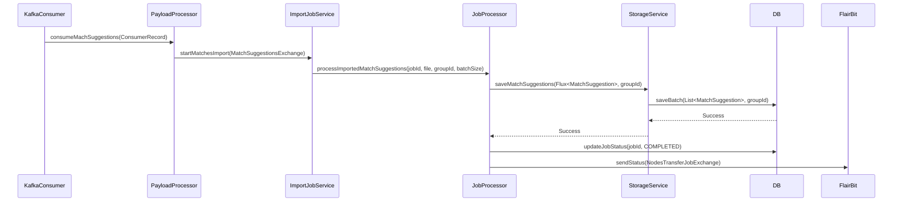
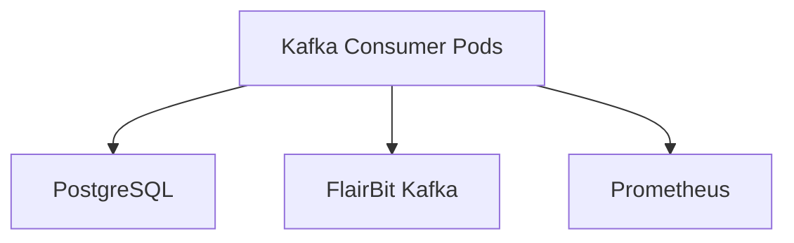

# **Low-Level Design (LLD) for Match Suggestions Import Module**

---

## **1. Overview**
The **Match Suggestions Import Module** is responsible for **importing match suggestions** from an external system (FlairBit) into the dating app's database. It processes **Parquet files** containing match suggestions, validates them, and stores them efficiently using **batch processing** and **asynchronous I/O**.

---

## **2. System Components**

### **2.1. Class Diagram**


---

## **3. Key Workflows**

### **3.1. Kafka Consumption Flow**


### **3.2. Sequence Diagram for Import Job**


---

## **4. Detailed Component Design**

### **4.1. `BaseKafkaConsumer` (Abstract Class)**
- **Purpose**: Base class for Kafka consumers with **DLQ (Dead Letter Queue)** support.
- **Key Methods**:
    - `consume()`: Processes a Kafka message asynchronously.
    - Handles errors by sending failed messages to DLQ.

```java
public void consume(ConsumerRecord<String, String> consumerRecord, KafkaListenerConfig config) {
    String payload = consumerRecord.value();
    if (payload == null) {
        dlqProducer.sendMessage(config.getDlqTopic(), consumerRecord.key(), consumerRecord.value());
        return;
    }

    CompletableFuture.runAsync(() -> {
        try {
            config.getPayloadProcessor().process(payload).join();
        } catch (Exception e) {
            dlqProducer.sendMessage(config.getDlqTopic(), consumerRecord.key(), consumerRecord.value());
        }
    });
}
```

### **4.2. `MatchSuggestionsKafkaConsumer`**
- **Purpose**: Consumes match suggestions from Kafka.
- **Key Methods**:
    - `consumeMachSuggestions()`: Delegates to `BaseKafkaConsumer.consume()`.

```java
@KafkaListener(
    topicPattern = "#{@matchSuggestionsImportConfig.topicPattern}",
    groupId = "#{@matchSuggestionsImportConfig.groupId}",
    concurrency = "#{@matchSuggestionsImportConfig.concurrency}"
)
public void consumeMachSuggestions(ConsumerRecord<String, String> consumerRecord) {
    consume(consumerRecord, getListenerConfigs().get(1));
}
```

### **4.3. `FlairBitPayloadProcessor`**
- **Purpose**: Processes Kafka payloads and starts import jobs.
- **Key Methods**:
    - `processImportedMatchSuggestionsPayload()`: Parses payload and starts import.

```java
public CompletableFuture<Void> processImportedMatchSuggestionsPayload(String payload) {
    MatchSuggestionsExchange parsedPayload = BasicUtility.safeParse(payload, MatchSuggestionsExchange.class);
    if (parsedPayload == null) {
        return CompletableFuture.completedFuture(null);
    }
    return importJobService.startMatchesImport(parsedPayload);
}
```

### **4.4. `ImportJobServiceImpl`**
- **Purpose**: Initiates import jobs and validates payloads.
- **Key Methods**:
    - `startMatchesImport()`: Creates a job record and starts processing.

```java
@Override
@Transactional
public CompletableFuture<Void> startMatchesImport(MatchSuggestionsExchange payload) {
    if (!MatchExportValidator.isValidPayload(payload)) {
        return CompletableFuture.failedFuture(new BadRequestException("Invalid payload"));
    }
    UUID jobId = initiateNodesImport(payload);
    matchSuggestionsImportJobService.processImportedMatchSuggestions(jobId, file, payload.getGroupId(), BATCH_SIZE);
}
```

### **4.5. `MatchSuggestionsImportJobService`**
- **Purpose**: Orchestrates the import job processing.
- **Key Methods**:
    - `processImportedMatchSuggestions()`: Delegates to `MatchSuggestionsImportJobProcessor`.

```java
public CompletableFuture<Void> processImportedMatchSuggestions(UUID jobId, MultipartFile file, String groupId, int batchSize) {
    return CompletableFuture.runAsync(() -> {
        matchSuggestionsImportJobProcessor.process(jobId, file, groupId, batchSize);
    });
}
```

### **4.6. `MatchSuggestionsImportJobProcessor`**
- **Purpose**: Processes the import job in **batches** using **reactive streams**.
- **Key Methods**:
    - `process()`: Reads Parquet file, processes batches, and updates job status.

```java
public CompletableFuture<Object> process(UUID jobId, MultipartFile file, String groupId, int batchSize) {
    transactionTemplate.execute(status -> {
        repository.updateStatus(jobId, JobStatus.PROCESSING);
        return null;
    });

    AtomicInteger totalCounter = new AtomicInteger();
    AtomicInteger errorCounter = new AtomicInteger();

    return ParquetParser.parseInStream(file.getInputStream(), factory)
            .buffer(batchSize)
            .concatMap(batch -> {
                totalCounter.addAndGet(batch.size());
                Flux<MatchSuggestion> suggestions = RequestMakerUtility.convertResponsesToMatchSuggestions(Flux.fromIterable(batch), groupId);
                return Mono.fromFuture(service.saveMatchSuggestions(suggestions, groupId))
                        .then(Mono.fromRunnable(() -> repository.incrementProcessed(jobId, batch.size())))
                        .doOnError(e -> errorCounter.incrementAndGet(batch.size()))
                        .onErrorResume(e -> Mono.empty());
            })
            .then(Mono.fromRunnable(() -> {
                int total = totalCounter.get();
                int processed = repository.getProcessedRows(jobId);
                if (processed < total - errorCounter.get()) {
                    failJob(jobId, groupId, "Some match suggestions failed", processed, total);
                } else {
                    completeJob(jobId, groupId, total);
                }
            }))
            .toFuture();
}
```

### **4.7. `MatchSuggestionsStorageService`**
- **Purpose**: Interface for storing and retrieving match suggestions.
- **Key Methods**:
    - `saveMatchSuggestions()`: Saves match suggestions in batches.
    - `retrieveMatchSuggestions()`: Retrieves match suggestions for a user.

```java
public CompletableFuture<Void> saveMatchSuggestions(Flux<MatchSuggestion> matchSuggestions, String groupId) {
    return processor.saveMatchSuggestions(matchSuggestions, groupId)
            .orTimeout(1_800_000, TimeUnit.MILLISECONDS);
}
```

### **4.8. `MatchSuggestionsStorageProcessor`**
- **Purpose**: Implements storage operations using **JDBC batch processing**.
- **Key Methods**:
    - `saveMatchSuggestions()`: Processes batches asynchronously.
    - `saveBatch()`: Uses **PostgreSQL COPY** for efficient bulk inserts.
    - `findFilteredSuggestions()`: Retrieves match suggestions for a user.

```java
public CompletableFuture<Void> saveMatchSuggestions(Flux<MatchSuggestion> matches, String groupId) {
    return matches
            .buffer(batchSize)
            .concatMap(batch -> Mono.fromFuture(CompletableFuture.runAsync(() -> saveBatch(batch, groupId), ioExecutor)))
            .then()
            .toFuture();
}

@Transactional
@Retryable(value = {SQLException.class, TimeoutException.class}, backoff = @Backoff(delay = 1000, multiplier = 2))
private void saveBatch(List<MatchSuggestion> batch, String groupId) {
    try (Connection conn = dataSource.getConnection()) {
        conn.setAutoCommit(false);
        CopyManager copyManager = new CopyManager(conn.unwrap(BaseConnection.class));
        InputStream binaryStream = new BinaryCopyInputStream<>(batch, new MatchSuggestionSerializer(batch, groupId));
        copyManager.copyIn("COPY temp_match_suggestions (...) FROM STDIN WITH (FORMAT BINARY)", binaryStream);
        conn.commit();
    }
}
```

### **4.9. `MatchSuggestionsImportJobRepository`**
- **Purpose**: Manages job status and progress.
- **Key Methods**:
    - `updateStatus()`: Updates job status.
    - `incrementProcessed()`: Increments processed row count.
    - `markCompleted()`/`markFailed()`: Finalizes job status.

```java
@Modifying
@Query("UPDATE MatchSuggestionsImportJob g SET g.status = :status WHERE g.id = :jobId")
void updateStatus(@Param("jobId") UUID jobId, @Param("status") JobStatus status);
```

---

## **5. Data Models**

### **5.1. `MatchSuggestionsExchange` (Kafka Payload)**
```java
public record MatchSuggestionsExchange(
    String groupId,
    String fileName,
    String filePath,
    String contentType,
    UUID domainId
) {}
```

### **5.2. `MatchSuggestion` (Database Entity)**
```java
@Entity
@Table(name = "match_suggestions")
public class MatchSuggestion {
    @Id
    private UUID id;
    private String groupId;
    private String participantId;
    private String matchedParticipantId;
    private Double compatibilityScore;
    private LocalDateTime createdAt;
    private String matchSuggestionType;
}
```

### **5.3. `MatchSuggestionsImportJob` (Job Tracking)**
```java
@Entity
@Table(name = "match_suggestions_import_jobs")
public class MatchSuggestionsImportJob {
    @Id
    private UUID id;
    private String groupId;
    private JobStatus status;
    private int totalRows;
    private int processedRows;
    private String errorMessage;
    private LocalDateTime completedAt;
}
```

### **5.4. `NodesTransferJobExchange` (Status Update Payload)**
```java
public record NodesTransferJobExchange(
    UUID jobId,
    String groupId,
    String status,
    int processed,
    int total,
    List<String> errors,
    List<String> warnings,
    String domainId
) {}
```

---

## **6. Key Algorithms & Techniques**

### **6.1. Batch Processing with Reactive Streams**
- Uses **Project Reactor (`Flux`)** for reactive batch processing.
- Processes records in **configurable batch sizes** (default: `1000`).
- **Non-blocking I/O** with `CompletableFuture` and `ExecutorService`.

```java
ParquetParser.parseInStream(file.getInputStream(), factory)
    .buffer(batchSize)
    .concatMap(batch -> {
        Flux<MatchSuggestion> suggestions = RequestMakerUtility.convertResponsesToMatchSuggestions(Flux.fromIterable(batch), groupId);
        return Mono.fromFuture(service.saveMatchSuggestions(suggestions, groupId))
                .then(Mono.fromRunnable(() -> repository.incrementProcessed(jobId, batch.size())));
    })
    .then()
    .toFuture();
```

### **6.2. Efficient Bulk Inserts with PostgreSQL COPY**
- Uses **PostgreSQL COPY** for high-performance bulk inserts.
- **Binary format** for efficient serialization.
- **Transaction management** with `SET synchronous_commit = OFF` for performance.

```java
CopyManager copyManager = new CopyManager(conn.unwrap(BaseConnection.class));
InputStream binaryStream = new BinaryCopyInputStream<>(batch, new MatchSuggestionSerializer(batch, groupId));
copyManager.copyIn("COPY temp_match_suggestions (...) FROM STDIN WITH (FORMAT BINARY)", binaryStream);
```

### **6.3. Retry Mechanism for Database Operations**
- Uses **Spring Retry** (`@Retryable`) for transient failures.
- **Exponential backoff** (1s, 2s, 4s) for retries.

```java
@Retryable(value = {SQLException.class, TimeoutException.class}, backoff = @Backoff(delay = 1000, multiplier = 2))
private void saveBatch(List<MatchSuggestion> batch, String groupId) { ... }
```

### **6.4. Graceful Shutdown Handling**
- **`@PreDestroy`** for cleanup on shutdown.
- **Volatile flag** (`shutdownInitiated`) to abort operations.

```java
@PreDestroy
private void shutdown() {
    shutdownInitiated = true;
    ioExecutor.shutdown();
    dataSource.close();
}
```

---

## **7. Error Handling & Recovery**

| **Scenario**                     | **Recovery Mechanism**                                                                 |
|----------------------------------|---------------------------------------------------------------------------------------|
| **Null Payload**                 | Logs warning and sends to DLQ.                                                        |
| **Invalid Payload**              | Rejects with `BadRequestException`.                                                  |
| **Parquet Parse Failure**        | Logs error and marks job as failed.                                                  |
| **Database Failure**             | Retries with exponential backoff.                                                    |
| **Batch Processing Failure**     | Skips failed batch, continues with next.                                           |
| **Job Timeout**                  | Marks job as failed after `OPERATION_TIMEOUT_MS` (30 minutes).                     |
| **Shutdown During Processing**   | Aborts operations gracefully.                                                        |

---

## **8. Metrics & Monitoring**
Uses **Micrometer** to track:
- **Import duration** (`match_suggestions_storage_duration`)
- **Batch processing time** (`match_suggestions_storage_batch_duration`)
- **Errors** (`match_suggestions_storage_errors_total`)
- **Processed records** (`match_suggestions_storage_matches_saved_total`)

```java
meterRegistry.timer("match_suggestions_storage_duration", "groupId", groupId)
    .record(durationMs, TimeUnit.MILLISECONDS);
```

---

## **9. Performance Optimizations**

| **Optimization**               | **Implementation**                                                                 |
|--------------------------------|-----------------------------------------------------------------------------------|
| **Reactive Streams**           | Uses `Flux` and `Mono` for non-blocking processing.                              |
| **Batch Processing**          | Processes records in batches (`batchSize=1000`).                                  |
| **PostgreSQL COPY**            | Uses binary COPY for efficient bulk inserts.                                      |
| **Asynchronous I/O**           | Uses `CompletableFuture` and `ExecutorService` for parallel processing.         |
| **Connection Pooling**         | Uses `HikariDataSource` for efficient DB connections.                            |
| **Transaction Optimization**   | Disables `synchronous_commit` for better write performance.                     |
| **Timeout Handling**           | Sets `OPERATION_TIMEOUT_MS` (30 minutes) to prevent hangs.                       |
| **Memory Efficiency**          | Streams Parquet file without loading entire file into memory.                   |

---

## **10. Threading & Concurrency Model**

| **Component**                     | **Concurrency Approach**                                                                 |
|----------------------------------|-----------------------------------------------------------------------------------------|
| **Kafka Consumer**               | Configurable concurrency (`concurrency` in `@KafkaListener`).                          |
| **Batch Processing**             | Uses `ExecutorService` (`ioExecutor`) for parallel batch processing.                 |
| **Database Operations**          | Single-threaded per batch (to avoid connection contention).                          |
| **Reactive Streams**             | Non-blocking processing with `Flux` and `Mono`.                                      |
| **Asynchronous Job Processing**  | Uses `CompletableFuture` for non-blocking job execution.                              |

---

## **11. Database Schema**

### **11.1. `match_suggestions` (Main Table)**
```sql
CREATE TABLE match_suggestions (
    id UUID PRIMARY KEY,
    group_id VARCHAR(255) NOT NULL,
    participant_id VARCHAR(255) NOT NULL,
    matched_participant_id VARCHAR(255) NOT NULL,
    compatibility_score DOUBLE PRECISION,
    match_suggestion_type VARCHAR(50),
    created_at TIMESTAMP NOT NULL,
    CONSTRAINT fk_group FOREIGN KEY (group_id) REFERENCES group_config(id)
);
```

### **11.2. `match_suggestions_import_jobs` (Job Tracking)**
```sql
CREATE TABLE match_suggestions_import_jobs (
    id UUID PRIMARY KEY,
    group_id VARCHAR(255) NOT NULL,
    status VARCHAR(20) NOT NULL,
    total_rows INTEGER DEFAULT 0,
    processed_rows INTEGER DEFAULT 0,
    error_message TEXT,
    completed_at TIMESTAMP,
    CONSTRAINT fk_group FOREIGN KEY (group_id) REFERENCES group_config(id)
);
```

### **11.3. Temporary Table for Batch Processing**
```sql
CREATE TEMPORARY TABLE temp_match_suggestions (
    id UUID,
    group_id VARCHAR(255),
    participant_id VARCHAR(255),
    matched_participant_id VARCHAR(255),
    compatibility_score DOUBLE PRECISION,
    match_suggestion_type VARCHAR(50),
    created_at TIMESTAMP
) ON COMMIT DROP;
```

---

## **12. Integration Points**

| **System**         | **Integration Method**       | **Purpose**                                  |
|--------------------|-----------------------------|---------------------------------------------|
| **Kafka**          | `@KafkaListener`            | Consumes match suggestion files.            |
| **FlairBit**       | `FlairBitProducer`          | Sends job status updates.                  |
| **MinIO**          | (Indirect via User Export)  | Stores original Parquet files.             |
| **PostgreSQL**      | JDBC, HikariCP              | Stores match suggestions.                  |
| **Prometheus**     | Micrometer                  | Tracks performance metrics.                |

---

## **13. Deployment & Scaling**

### **13.1. Deployment Architecture**


### **13.2. Scaling Strategy**
| **Component**               | **Scaling Approach**                          |
|-----------------------------|-----------------------------------------------|
| **Kafka Consumers**         | Horizontal scaling (increase `concurrency`).  |
| **Database**                | Read replicas for job status queries.         |
| **Batch Processing**        | Adjust `batchSize` based on load.             |
| **Executor Service**        | Tune thread pool size (`ioExecutor`).         |

---

## **14. Future Enhancements**

🔹 **Incremental Imports** – Track last imported timestamp to avoid reprocessing.
🔹 **Dynamic Batch Sizing** – Adjust batch size based on system load.
🔹 **Exactly-Once Processing** – Use Kafka consumer offsets to avoid duplicates.
🔹 **Multi-Format Support** – Add support for JSON/CSV inputs.
🔹 **Real-Time Validation** – Validate records before batch processing.
🔹 **Distributed Processing** – Use Kafka Streams for scalable processing.

---

### **Key Takeaways**
- **Reactive & Non-Blocking**: Uses `Flux`, `Mono`, and `CompletableFuture`.
- **Efficient Bulk Inserts**: PostgreSQL COPY with binary format.
- **Fault Tolerant**: Retries, DLQ, and graceful shutdown.
- **Observable**: Detailed metrics for monitoring.
- **Scalable**: Designed for horizontal scaling.

---
