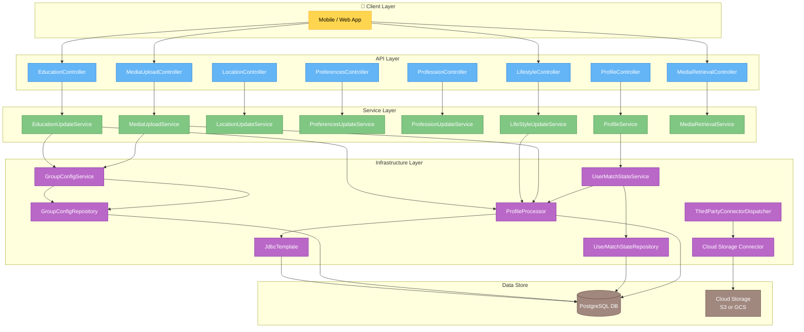
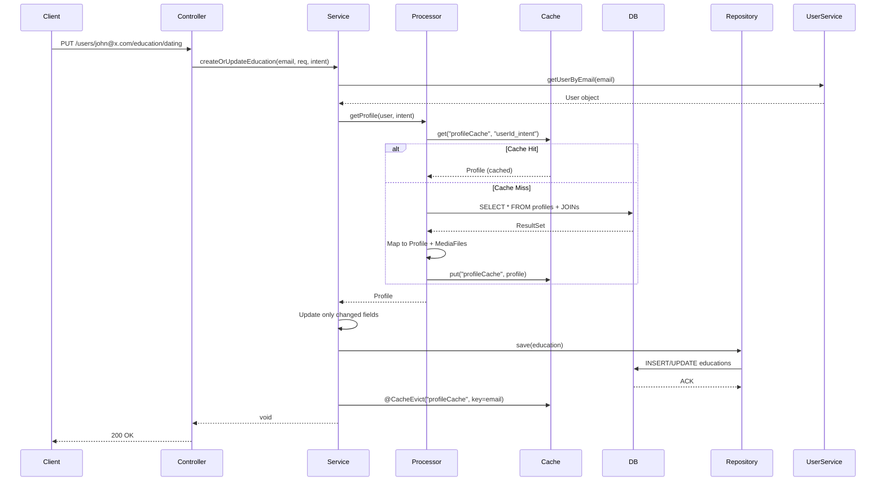
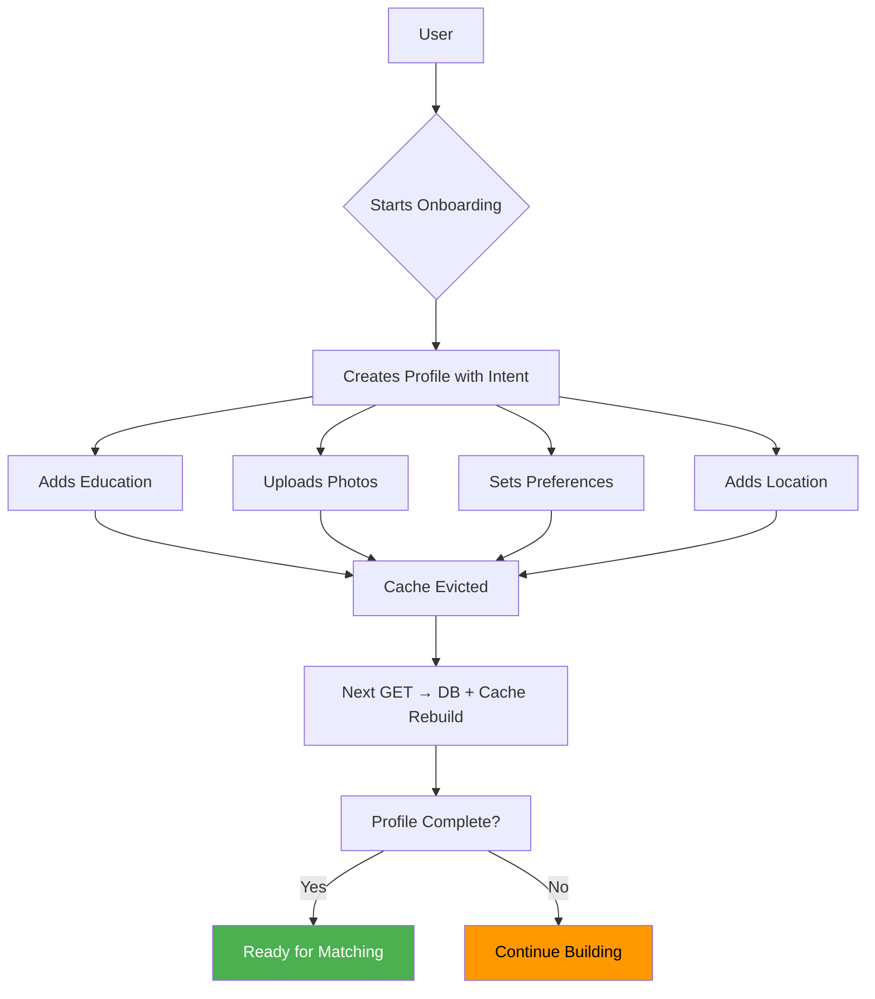

# **Low-Level Design (LLD): Progressive Profiling System for Dating App**

> A modular, intent-based, cache-optimized profile management system enabling users to gradually build their dating profiles.

---

## 1. **System Overview**

### Purpose
Enable **progressive onboarding** where users fill out personal details (education, lifestyle, etc.) over time — improving conversion and UX.

### Core Features
- Create/update profile sections independently
- Support multiple **intents** per user (e.g., “Dating”, “Marriage”)
- Media upload & retrieval (photos/videos/reels)
- Match-readiness tracking via `UserMatchState`
- High-performance reads using caching
- Partitioned media storage for scalability

---

## 2. **Entity Relationship Diagram (ERD)**

```text
┌────────────┐       ┌───────────┐
│   User     │───────▶│  Profile  │
└────────────┘ 1    1 └───────────┘
    │                   ▲
    │                   │ 1
    │             ┌──────────────┐
    └────────────▶│ UserRoles    │
                  └──────────────┘
                                ▲
                                │
                          ┌────────────┐
                          │   Role     │
                          └────────────┘

Each Profile has optional 1:1 relationships to:
┌────────────┐   ┌────────────┐   ┌────────────┐
│ Education  │   │ Profession │   │  Location  │
└────────────┘   └────────────┘   └────────────┘
       │               │               │
       ▼               ▼               ▼
┌────────────┐   ┌────────────┐   ┌────────────┐
│  Lifestyle │   │Preferences │   │UserMatchSt.│
└────────────┘   └────────────┘   └────────────┘
       ▲
       │
┌────────────┐
│ MediaFile  │ (1..N per profile)
└────────────┘

Global Config:
┌─────────────────┐
│  GroupConfig    │
│ (intent → group)│
└─────────────────┘
```

### Key Tables & Relationships

| Table | Description | Key Columns | Constraints |
|------|-------------|------------|-------------|
| `users` | Core user data | `id`, `email`, `username` | Unique email/username |
| `profiles` | One or more per user | `user_id`, `intent` | FK to users; index on `(user_id)` |
| `educations` | Education detail | `profile_id` | Unique FK to profile |
| `professions` | Job info | `profile_id` | Unique FK |
| `locations` | City/country | `profile_id` | Unique FK |
| `lifestyles` | Habits & beliefs | `profile_id` | Unique FK |
| `preferences` | Match preferences | `profile_id` | Unique FK |
| `user_match_states` | Matching eligibility | `profile_id`, `intent`, `group_id`, `ready_for_matching` | Indexed for matching queries |
| `media_files` | Photos/videos | `profile_id`, `reel_type`, `uploaded_at` | Partitioned by time |
| `group_config` | Intent → group mapping | `intent`, `id`, `type`, `active` | Active groups only used |

> All child tables (`education`, `profession`, etc.) link **uniquely** to `profile_id`.

> `profiles.user_id` was originally unique → changed to allow **multi-intent profiles**.

---

## 3. **Component Architecture Diagram**



---

## 4. **Sequence Diagram: Update Education**



> Only modified fields are updated  
> Cache invalidated after write  
> Read-heavy ops benefit from caching

---

## 5. **Data Flow & Key Workflows**

### Workflow: Create Full Profile (Step-by-Step)

1. **Register User**
    - `POST /auth/register` → creates `User` with email/password
2. **Create Profile**
    - `PUT /users/{email}/profile`
    - Sets `displayName`, `headline`, `dob`, `gender`, `intent`
    - Triggers `UserMatchState` creation with `groupId` from `GroupConfig(intent)`
3. **Add Sections**
    - Any order:
        - Education
        - Lifestyle
        - Location
        - Profession
        - Preferences
4. **Upload Media**
    - `POST /users/{email}/media/upload/{intent}`
    - Max `N` reels enforced
    - Stored in cloud, metadata in `media_files`
5. **Mark Ready for Matching**
    - When all required sections filled → backend sets:
      ```java
      userMatchState.setProfileComplete(true)
      userMatchState.setReadyForMatching(true)
      ```

---

## 6. **Key Design Decisions**

| Decision | Why? | Benefit |
|--------|------|--------|
| **Intent-Based Profiles** | Support multiple relationship goals | Personalization, better matching |
| **Manual SQL + RowMapper** | Avoid N+1, eager load entire graph | Fast profile reads |
| **Spring Cache (`@Cacheable`) **+ `@CacheEvict` | Reduce DB load | High throughput |
| **Partitioned `media_files`** | Scale large media tables | Faster queries, easier archiving |
| **Separate Read/Write Services** | Optimize for use case | Cleaner logic |
| **UPSERT via Conditional Setters** | Allow partial updates safely | No overwrites |
| **Third-Party Dispatcher Pattern** | Abstract external integrations | Swappable storage providers |

---

## 7. **Schema Highlights & Optimizations**

### Multi-Intent Support
```sql
-- Removed unique constraint on profiles.user_id
-- Now allows:
INSERT INTO profiles (user_id, intent) VALUES ('u1', 'DATING');
INSERT INTO profiles (user_id, intent) VALUES ('u1', 'MARRIAGE');
```

### Time-Based Partitioning for Media
```sql
CREATE TABLE media_files PARTITION BY RANGE (uploaded_at);
CREATE TABLE media_files_y2025m05 FOR VALUES FROM ('2025-05') TO ('2025-06');
...
```
> Improves query performance and maintenance (e.g., TTL via dropping partitions)

### Indexed for Matching Engine
```sql
-- For finding users ready to match in group
CREATE INDEX idx_usermatchstates_groupid_sent ON user_match_states(group_id, sent_to_matching_service);

-- For intent-based lookup
CREATE INDEX idx_usermatchstates_userid_intent ON user_match_states(profile_id, intent);
```

### Enum Constraints
```sql
ALTER TABLE group_config ADD CONSTRAINT ck_group_config_type 
CHECK (type IN ('COST_BASED', 'NON_COST_BASED'));
```

---

## 8. **Validation & Guardrails**

| Layer | Enforcement |
|------|-------------|
| **Controller** | `@Valid`, `@RequestBody`, path variable validation |
| **Service** | `ObjectUtils.allNull()`, `if (profile == null)` |
| **DB** | Foreign keys, unique constraints, NOT NULL where needed |
| **Business Logic** | Max media count check before save |
| **Security** | (Missing) Add Spring Security pre-auth checks |

---

## 9. **Scalability & Observability**

| Area | Strategy |
|------|---------|
| **Caching** | Redis/Memcached for `profileCache`, `groupCache` |
| **DB Scaling** | Read replicas for retrieval endpoints |
| **Media** | Offload to CDN (cloud storage + CloudFront/S3) |
| **Async Reads** | `CompletableFuture` for media feeds |
| **Monitoring** | Log cache hits, DB query times, upload latency |
| **Tracing** | Use OpenTelemetry for end-to-end flow |

---

## 10. **Future Improvements**

| Enhancement | Description |
|-----------|-------------|
| **Event Publishing** | Emit `ProfileUpdatedEvent` for downstream services (analytics, recommendations) |
| **Soft Deletes** | Add `deleted_at` instead of hard delete |
| **Audit Logs** | Track who changed what and when |
| **GraphQL API** | Let clients fetch only needed fields |
| **Profile Completeness Engine** | Auto-calculate completeness score |
| **Scheduled Partition Creator** | Automatically generate future `media_files` partitions monthly |

---

## Final Diagram: High-Level Flow



---