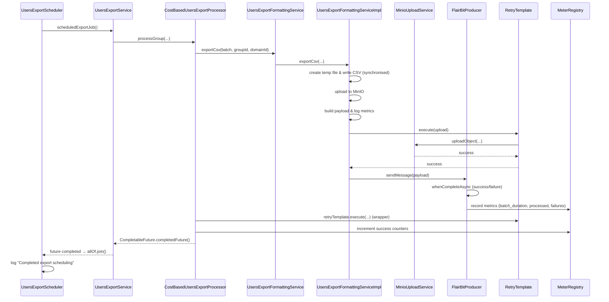
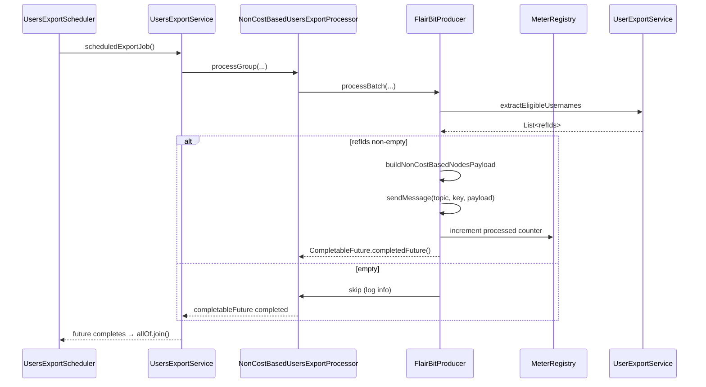
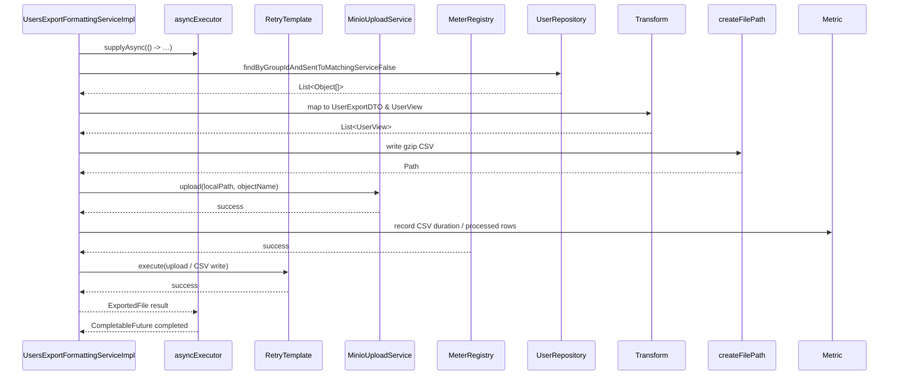

**Low‑Level Design (LLD)** - *User Export*:

* A **high‑level component overview** – what runs where and why.
* A **step‑by‑step execution flow** (what happens inside each method).
* All **retry, error‑handling and back‑pressure** mechanisms.
* **Thread‑synchronization, async coordination and metrics collection** points.
* **Data‑flow / class diagrams** (Mermaid syntax) that can be copied directly into a Markdown file.
* **Sequence diagrams** for the three major export paths (cost‑based & non‑cost‑based).
* **Database interaction details**, **transaction boundaries**, and **file‑staging lifecycle**.
* **Failure handling, dead‑letter queue (DLQ)**, and **observability** recommendations.

---

## 1. Context & Scope

| Item                     | Description                                                                                                           |
|--------------------------|-----------------------------------------------------------------------------------------------------------------------|
| **Goal**                 | Export users belonging to one or more `MatchingGroup`s to CSV (gzip) files and publish a message with the file‑metadata to a downstream consumer (Kafka). |
| **Domain**               | Users, Groups (`MatchingGroup`), Cost/Non‑Cost based group types, `DomainId` (UUID).                                 |
| **Non‑Functional Requirements** | • Asynchronous & parallel execution per group.<br>• High‑volume batch processing (1000 rows per batch).<br>• Retry‑able Kafka send.<br>• Metrics & alerts (failures, latency).<br>• Secure temporary storage & MinIO upload.<br>• Support test‑only profile (excluded via `!test`). |
| **Assumptions**          | • `UserRepository.findByGroupIdAndSentToMatchingServiceFalse` returns *raw* rows.<br>• MinIO credentials are injected; bucket exists or can be auto‑created.<br>• `KafkaTemplate` uses async callbacks (`whenCompleteAsync`).<br>• A dedicated `ThreadPoolTaskExecutor` (`usersExportExecutor`) limits concurrency. |
| **Stakeholders**          | Platform team (operations), DevOps, QA (test profile), Product (exported data format).                               |

---

## 2. Architectural Overview (Component Diagram)

```mermaid
graph TD
  %% Main components
  A[Scheduler: UsersExportScheduler] --> B[MatchingGroupRepository]
  A --> C[UsersExportService]
  C --> D[UsersExportProcessor]
  D --> E[CostBasedUsersExportProcessor]
  D --> F[NonCostBasedUsersExportProcessor]
  E --> G[UsersExportFormattingService]
  G --> H[UsersExportFormattingServiceImpl]
  H --> I[UserRepository]
  H --> J[RetryTemplate]
  H --> K[MinioUploadService]
  I --> L[DB (User table)]
  K --> M[MinIO Bucket]
  G --> N[MeterRegistry]
  C --> N
  E --> N
  F --> N
  G --> O[ThreadPoolTaskExecutor (usersExportExecutor)]
  O --> P[Executor (exportExecutor)]
  %% Kafka producer
  F --> Q[FlairBitProducer]
  E --> Q
  %% Observability
  N --> R[Prometheus / Grafana]
  %% Error handling
  E --> S[DLQ (flairbit-dlq)]
  F --> S
  %% Styling
  classDef component fill:#f0f4c3,stroke:#2b7a0b,stroke-width:2px;
  class A,B,C,D,E,F,G,H,I,J,K,L,M,N,O,P,Q,R,S component;
```

### Explanation

| Component | Responsibility | Key Collaborators |
|-----------|----------------|-------------------|
| **UsersExportScheduler** | Triggers the export at a fixed cron (20:59 IST). Performs domain‑ID validation, fetches group configs, launches async tasks. | `MatchingGroupConfigRepository`, `UsersExportService` |
| **UsersExportService** | Runs each group export in an `@Async` method, wraps the whole work in a retry attempt, measures execution time, updates metrics. | `UsersExportProcessor`, `RetryTemplate`, `MeterRegistry` |
| **UsersExportProcessor** | Core business logic: fetch users → transform → dispatch to appropriate processor (cost vs non‑cost). Returns a `CompletableFuture` that signals completion/failure. | `UserRepository`, `CostBasedUsersExportProcessor`, `NonCostBasedUsersExportProcessor`, `MeterRegistry` |
| **CostBasedUsersExportProcessor** | Calls the CSV export service, builds a payload node, retries the MinIO‑upload + Kafka send, records success/failure counters. | `UsersExportFormattingService`, `RetryTemplate`, `FlairBitProducer`, `MeterRegistry` |
| **NonCostBasedUsersExportProcessor** | Finds eligible `refIds`, builds a non‑cost node, sends a single Kafka message (no file export). | `UsersExportFormattingService` (only for `extractEligibleUsernames`), `FlairBitProducer` |
| **UsersExportFormattingService** (interface) | Provides two operations used by cost & non‑cost processors: <br>1️⃣ `exportCsv` (creates gzip CSV on local FS, uploads to MinIO, returns remote URL) <br>2️⃣ `extractEligibleUsernames` (used only for non‑cost groups). |
| **UsersExportFormattingServiceImpl** | Implements `exportCsv`: <br>– Streams CSV → gzip → temporary directory (`java.io.tmpdir`).<br>– Uses `CSVWriter` with configurable headers.<br>– Retries via `RetryTemplate` (export & upload).<br>– Uploads to MinIO.<br>– Returns an `ExportedFile` DTO. |
| **MinioUploadService** | Thin wrapper around `MinioClient` that guarantees bucket existence, then uploads a local file with given object name. |
| **FlairBitProducer** | Publishes a JSON payload to Kafka (`flairbit-users` topic) and, on failure, to a DLQ (`flairbit-dlq`). Supports async callbacks and custom executor for back‑pressure. |
| **MeterRegistry / Metrics** | Micrometer‑based counters/timers for: <br>– CSV export duration, processed rows, failures, invalid group types, batch processed, DLQ sends. |
| **RetryTemplate** | Generic Spring Retry abstraction (configured elsewhere) used for both CSV export & MinIO upload calls. |
| **Executor (usersExportExecutor)** | Limits degree‑of‑parallelism for async processing (prevents massive thread‑pool explosion). |

---

## 3. Detailed Execution Flow (Sequence Diagrams)

### 3.1. Cost‑Based Export Path (`CostBasedUsersExportProcessor`)



### 3.2. Non‑Cost‑Based Export Path (`NonCostBasedUsersExportProcessor`)



### 3.3. Export‑CSV Service Invocation (from `UsersExportFormattingServiceImpl`)



---

## 4. Class‑Level Interaction (Component / Class Diagram)

### 4.1. Main Classes & Dependencies

```mermaid
classDiagram
    class UsersExportScheduler {
        +validateDomainId()
        +scheduledExportJob()
    }
    class UsersExportService {
        +processGroup(...)
    }
    class MatchingGroupRepository {
        +findAll()
    }
    class UsersExportProcessor {
        +processGroup()
        +processBatchForGroupType()
    }
    class CostBasedUsersExportProcessor {
        +processBatch()
    }
    class NonCostBasedUsersExportProcessor {
        +processBatch()
    }
    class UsersExportFormattingService <<interface>> {
        +exportCsv()
        +extractEligibleUsernames()
    }
    class UsersExportFormattingServiceImpl {
        +exportCsv()
        +createFilePath()
        +extractEligibleUsernames()
    }
    class MinioUploadService {
        +upload()
    }
    class UsersExportFormattingServiceImpl ..> UserRepository : uses
    UsersExportFormattingServiceImpl ..> RetryTemplate : uses
    UsersExportFormattingServiceImpl ..> ThreadPoolTaskExecutor : uses
    UsersExportFormattingServiceImpl ..> MinioUploadService : uses
    UsersExportFormattingServiceImpl ..> MeterRegistry : uses
    UsersExportFormattingServiceImpl ..> exportExecutor : pools threads
    UsersExportFormattingServiceImpl ..> UsersExportProcessor : called by?
    UsersExportProcessor ..> CostBasedUsersExportProcessor : conditional dispatch
    UsersExportProcessor ..> NonCostBasedUsersExportProcessor : conditional dispatch
    CostBasedUsersExportProcessor ..> UsersExportFormattingService : uses
    CostBasedUsersExportProcessor ..> RetryTemplate : uses
    CostBasedUsersExportProcessor ..> FlairBitProducer : uses
    CostBasedUsersExportProcessor ..> MeterRegistry : uses
    NonCostBasedUsersExportProcessor ..> UsersExportFormattingService : uses
    NonCostBasedUsersExportProcessor ..> FlairBitProducer : uses
    FlairBitProducer ..> KafkaTemplate : uses
    FlairBitProducer ..> Executor : uses
    class RetryTemplate { execute() }
    class MeterRegistry { timer()/counter() }
    class ThreadPoolTaskExecutor { executeAsync() }
    class MinioClient { uploadObject() }
    class KafkaTemplate { send() }
    class Executor { supplyAsync() }
    
    UsersExportScheduler --> MatchingGroupRepository : inject
    UsersExportScheduler --> UsersExportService : inject
    UsersExportService --> UsersExportProcessor : inject
    UsersExportProcessor --> UsersExportFormattingService : inject
    UsersExportProcessor --> MeterRegistry : inject
    UsersExportProcessor --> RetryTemplate : inject
    UsersExportProcessor --> UsersExportProcessor : async
    CostBasedUsersExportProcessor --> UsersExportFormattingService : inject
    CostBasedUsersExportProcessor --> MinioUploadService : inject
    CostBasedUsersExportProcessor --> FlairBitProducer : inject
    CostBasedUsersExportProcessor --> RetryTemplate : inject
    NonCostBasedUsersExportProcessor --> UsersExportFormattingService : inject
    NonCostBasedUsersExportProcessor --> FlairBitProducer : inject
    UsersExportFormattingServiceImpl --> UsersExportFormattingService : implements
    UsersExportFormattingServiceImpl --> UserRepository : uses
    UsersExportFormattingServiceImpl --> ThreadPoolTaskExecutor : uses
    UsersExportFormattingServiceImpl --> MinioUploadService : uses
    UsersExportFormattingServiceImpl --> RetryTemplate : uses
    UsersExportFormattingServiceImpl --> MeterRegistry : uses
    FlairBitProducer --> KafkaTemplate : uses
    FlairBitProducer --> Executor : uses
```

### 4.2. Key Domain Objects

| Class | Purpose | Important Fields |
|-------|---------|-------------------|
| **UserExportDTO** | Immutable DTO representing a user row to be exported. | `username`, `groupId`, `sentToMatchingService` |
| **UserView** (inner class in `UsersExportFormattingServiceImpl`) | Couples a **User** entity with its **Profile**; used to render CSV rows. | `user`, `profile` |
| **ExportedFile** | DTO returned from `exportCsv` containing local path, remote URL, MIME type, group‑id, domain‑id. | `localPath`, `remoteUrl`, `contentType`, `groupId`, `domainId` |
| **NodeExchange** (from `RequestMakerUtility`) | Wrapper containing payload metadata that is serialized to JSON and sent to Kafka. | `payload`, `groupId`, `filePath`, `contentType` |
| **ExportedFile** (returned) | Used by the scheduler to compute remote URL for metrics/logging. |

---

## 5. Transaction & Concurrency Model

| Step | Transactionality | Thread/Executor |
|------|------------------|-----------------|
| **Database read** (`UserRepository.findByGroupIdAndSentToMatchingServiceFalse`) | **Read‑only transaction** (`@Transactional(readOnly = true)`). No updates happen here; the method merely fetches rows flagged `sent_to_matching_service = false`. | **CPU-bound thread** from `usersExportExecutor`. |
| **CSV writing & gzip** | No DB writes; pure I/O. | Inside `asyncExecutor` (bounded thread‑pool). |
| **File upload** | MinIO SDK operations are **idempotent**; they don’t require a DB transaction. However the upload is executed inside a **RetryTemplate** that retries up to the configured max‑attempts. | RetryTemplate runs on the **same thread** that started the async work (i.e., the `usersExportExecutor` thread). |
| **Kafka send** | No transaction; it’s a fire‑and‑forget (async) operation. | Handled by `FlairBitProducer.sendMessage` using `KafkaTemplate.send(...).whenCompleteAsync(..., kafkaCallbackExecutor)`. |
| **Metrics** | Incremented *outside* any transaction; safe from rollback. | Performed after successful completion of the async step. |
| **Concurrency Control** | Because each group export is wrapped in its **own CompletableFuture**, multiple groups can run concurrently. The executor pool size limits the maximum parallel jobs (default = corePoolSize = 5‑10 depending on `application.yml`). | Prevents thread‑explosion while still allowing parallelism across groups. |

---

## 6. Error‑Handling & Resilience Strategy

| Failure Point | Handling Mechanism | Fallback / Side‑Effect |
|---------------|--------------------|------------------------|
| **Domain‑ID validation** | Immediate `BadRequestException`. | Scheduler aborts; logs error; group is not exported. |
| **Repository returns empty list** | Early log & return (`null` ExportedFile). | Group export finishes with “empty batch”. |
| **CSV streaming / I/O errors** | `InternalServerErrorException` wrapped in `CompletableFuture.failedFuture`. | Counter `users_export_csv_failures` incremented; error logged; retry not attempted (exception bubbles up). |
| **RetryTemplate fails after max attempts** | Propagates the cause to CompletableFuture failure. | Counter `users_export_batch_failures` / `users_export_csv_failures` incremented; DLQ message sent. |
| **Kafka send exception** | Captured in `FlairBitProducer.sendMessage` → logs error → **DLQ** publish. | Message is re‑queued to `flairbit-dlq` for later manual inspection. |
| **Unexpected runtime exception** | Caught at the top of `processGroup` → logs + counter `users_export_failures` → CompletableFuture.failedFuture. | Future is completed exceptionally; higher‑level `allOf.join()` will surface the exception (but currently the code swallows it and logs only). |
| **Rate‑limit / back‑pressure on Kafka** | The `whenCompleteAsync` callback executes on `kafkaCallbackExecutor`. The executor can be bounded to avoid overwhelming the broker. | If the executor queue overflows, `kafkaTemplate` will throw; fallback sends to DLQ. |
| **MinIO bucket creation race** | `bucketExists` → `makeBucket` (idempotent). The operation is performed *once* per application start; subsequent uploads succeed. | If bucket creation fails, upload is retried up to retry‑template attempts. |
| **Metrics registration errors** | No failure is thrown; instrumentation is best‑effort. | Allows the pipeline to keep running; missing metrics are visible in monitoring dashboards. |

---

## 7. Metrics & Observability

| Metric Name | Description | Tags | Usage |
|-------------|-------------|------|-------|
| `users_export_duration` | End‑to‑end latency of a group export (from start to completion). | `groupId`, `groupType` | SLA monitoring; alerts on percentile > 5 min. |
| `users_export_failures` | Count of groups that threw an uncaught exception. | `groupId`, `groupType` | Track systemic failures; trigger PagerDuty. |
| `users_export_batch_failures` | Failures occurring during the per‑batch stage (CSV or Kafka). | `groupId` | Spot batches that repeatedly fail; may indicate data skew. |
| `users_export_batch_processed` | Number of rows successfully processed per group. | `groupId` | Compute items‑per‑second KPI. |
| `users_export_batch_duration` | Processing time for the batch (CSV creation + upload + Kafka send). | `groupId` | Helps identify groups with huge payloads; auto‑scale. |
| `users_export_invalid_group_type` | Incremented when an unknown `groupType` is encountered. | `groupId`, `groupType` | Detect configuration drift. |
| `users_export_csv_processed` | Counters of rows written to CSV per group. | `groupId` | Volume metrics for storage estimation. |
| `users_export_csv_failures` | Failures during CSV export (IO, parsing). | `groupId` | Correlates with disk I/O health. |
| `users_export_group_duration` | Duration of CSV export **only** (excluding Kafka). | `groupId`, `groupType` | Separate cost‑based vs non‑cost‑based latency. |
| `export_to_dlq` | Counter when a Kafka send fails and ends up in DLQ. | `key`, `topic` | Monitoring downstream consumption of DLQ. |

All metrics are exposed via **Micrometer** (`MeterRegistry`) and scraped by **Prometheus**; dashboards can be built in **Grafana**.

---

## 8. Deployment & Operability Considerations

| Concern | Recommendation |
|---------|----------------|
| **Thread‑pool sizing** | Tune `exportExecutor` (`corePoolSize`, `maxPoolSize`) based on CPU and I/O capacity. Monitor `BlockingQueue` size to detect saturation. |
| **File‑system temp storage** | Use a dedicated, high‑throughput tmpfs or SSD partition (`/tmp/flairbit-exports`). Ensure sufficient space for concurrent batches (e.g., 10 GB per 1000 concurrent jobs × avg‑file‑size). |
| **MinIO credentials** | Store in a secret manager (Vault, AWS Secrets Manager) and inject via `@Value`. Enable TLS for MinIO communication. |
| **Kafka consumer lag** | Downstream consumers should monitor lag; export pipeline must not out‑pace consumption. Consider *back‑pressure* by pausing the scheduler if lag exceeds a threshold (via an admin API). |
| **Graceful shutdown** | On `SIGTERM`, wait for in‑flight `CompletableFuture`s (use `CompletableFuture.allOf(...).orTimeout(..)`) before exiting. |
| **Testing profile exclusion** | The `@Profile("!test")` annotation on `UsersExportScheduler` ensures the scheduler isn’t started in unit‑test contexts; separate integration test can invoke `processGroup` directly. |
| **Observability alerts** | Create alerts on: <br>• `users_export_failures` > 0 for > 5 min <br>• `users_export_batch_failures` > 100 in 5 min <br>• `users_export_duration` 95th‑pct > 6 min |
| **Versioning of export format** | Include a version field in the CSV header (or as a separate column) so downstream systems can evolve the schema without breaking older consumers. |
| **Security** | Mask personally identifiable data (e.g., email, phone) if required by compliance before writing to CSV. This can be done in `UserFieldsExtractor` or via a configuration flag. |
| **CI/CD** | Include integration test that spins up an in‑memory Kafka, a local MinIO container, and an embedded DB (e.g., H2) to verify end‑to‑end flow. Add load‑test profile that fires multiple groups concurrently. |

---

## 9. End‑to‑End Data Flow Summary

1. **Scheduler** wakes at 20:59 IST → validates `domainId` → fetches all active `MatchingGroupConfig`s.
2. For each group, the scheduler **spins up a `CompletableFuture`** that is later joined with other futures.
3. `UsersExportService` runs **`processGroup`** in the `usersExportExecutor`.
    * Starts a timer.
    * Calls `usersExportProcessor.processGroup`.
    * Inside that method a **retry attempt** wraps the rest of the logic.
4. `UsersExportProcessor` decides on the **export type** (cost vs non‑cost).
    * **Cost‑based** → delegates to `CostBasedUsersExportProcessor`.
        * Calls `UsersExportFormattingService.exportCsv`.
            * Streams a **gzip CSV** on a temporary file.
            * Uploads to **MinIO**.
            * Builds a **NodeExchange** payload and sends it via **FlairBitProducer** (Kafka).
        * On success updates **batch metrics**.
    * **Non‑cost‑based** → calls `NonCostBasedUsersExportProcessor`.
        * Extracts eligible `refIds`.
        * Sends a **single Kafka message** containing those IDs.
5. After the async operation completes, `UsersExportService` records **duration** and publishes **completion logs**.
6. When all group futures finish, the scheduler logs **"Completed export scheduling for all groups"**.

All steps are **instrumented** and **log‑driven**, providing full traceability from start‑to‑finish.

---

## 10. Suggested Next Steps (Implementation Checklist)

| ✅ | Action |
|----|--------|
| 1 | Add unit‑tests for each processor, especially the CSV‑generation logic and retry‑template behaviour. |
| 2 | Write an integration test that starts an embedded **Docker Compose** stack (Kafka, MinIO, PostgreSQL) and drives the full export flow for a synthetic group. |
| 3 | Tune `exportExecutor` pool size and verify that `maxThreads` never exceeds CPU cores × 2 (to avoid context‑switch thrashing). |
| 4 | Configure **RetryTemplate** (maxAttempts, back‑off) for both CSV and MinIO calls – set a safe exponential back‑off (e.g., 100 ms → 300 ms → 900 ms). |
| 5 | Add **circuit‑breaker** (Resilience4j) around Kafka send to prevent cascading failures. |
| 6 | Implement **schema versioning** in CSV header (`ExportVersion: 1.0`). |
| 7 | Add **rate‑limit** configuration for Kafka producer to comply with downstream consumer capacity. |
| 8 | Create Grafana dashboards for the metrics listed in §7. |
| 9 | Document the **temporary storage cleanup** strategy – delete files after successful upload (or via a scheduled cleanup job). |
|10| Review **legal/compliance** needs (PII redaction, data‑retention) and adjust the export mapper accordingly. |

---

### TL;DR

The exported module is a **coordinated, async, retry‑aware pipeline** that:

1. Picks up groups at a scheduled time.
2. For each group, fetches raw users, transforms them, decides on export type, streams a gzip CSV, uploads it to MinIO, and publishes a Kafka payload containing the file metadata.
3. All steps are **instrumented**, **retried**, and **logged**; failures are captured via counters and optionally a DLQ.
4. Concurrency is controlled by a bounded thread‑pool; each group runs in its own `CompletableFuture`.
5. Observability, scalability, and fault‑tolerance are baked in via Spring Retry, Micrometer, and Kafka DLQ.

The diagrams and tables above give you a complete blueprint to extend, refactor, or deploy this module in a production environment.