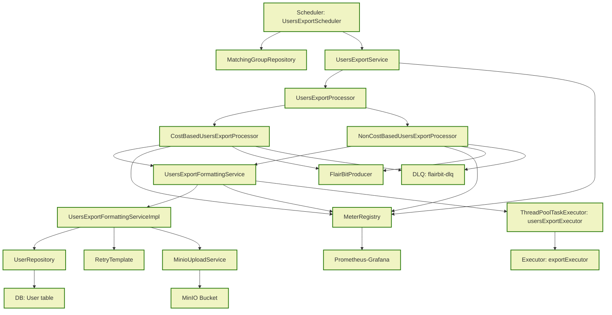
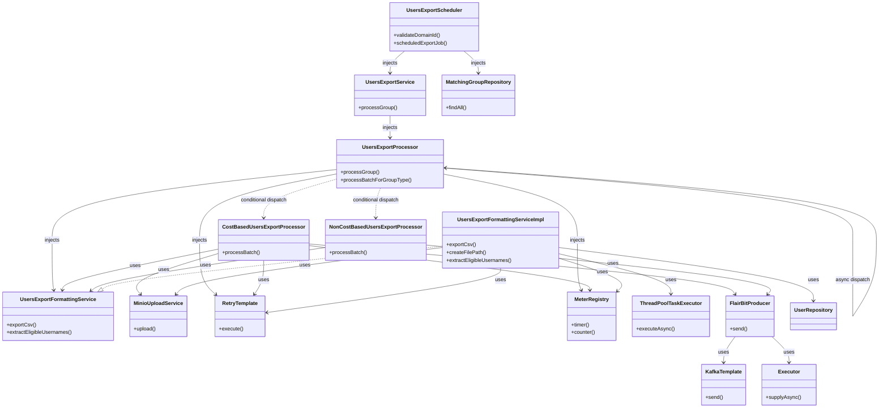

**Low‑Level Design (LLD)** - *User Export*:

* A **high‑level component overview** – what runs where and why.
* A **step‑by‑step execution flow** (what happens inside each method).
* All **retry, error‑handling and back‑pressure** mechanisms.
* **Thread‑synchronization, async coordination and metrics collection** points.
* **Data‑flow / class diagrams** (Mermaid syntax) that can be copied directly into a Markdown file.
* **Sequence diagrams** for the three major export paths (cost‑based & non‑cost‑based).
* **Database interaction details**, **transaction boundaries**, and **file‑staging lifecycle**.
* **Failure handling, dead‑letter queue (DLQ)**, and **observability** recommendations.

---

## 1. Context & Scope

| Item                     | Description                                                                                                           |
|--------------------------|-----------------------------------------------------------------------------------------------------------------------|
| **Goal**                 | Export users belonging to one or more `MatchingGroup`s to CSV (gzip) files and publish a message with the file‑metadata to a downstream consumer (Kafka). |
| **Domain**               | Users, Groups (`MatchingGroup`), Cost/Non‑Cost based group types, `DomainId` (UUID).                                 |
| **Non‑Functional Requirements** | • Asynchronous & parallel execution per group. • High‑volume batch processing (1000 rows per batch). • Retry‑able Kafka send. • Metrics & alerts (failures, latency). • Secure temporary storage & MinIO upload. • Support test‑only profile (excluded via `!test`). |
| **Assumptions**          | • `UserRepository.findByGroupIdAndSentToMatchingServiceFalse` returns *raw* rows. • MinIO credentials are injected; bucket exists or can be auto‑created. • `KafkaTemplate` uses async callbacks (`whenCompleteAsync`). • A dedicated `ThreadPoolTaskExecutor` (`usersExportExecutor`) limits concurrency. |
| **Stakeholders**          | Platform team (operations), DevOps, QA (test profile), Product (exported data format).                               |

---

## 2. Architectural Overview (Component Diagram)

### Explanation

| Component | Responsibility | Key Collaborators |
|-----------|----------------|-------------------|
| **UsersExportScheduler** | Triggers the export at a fixed cron (20:59 IST). Performs domain‑ID validation, fetches group configs, launches async tasks. | `MatchingGroupConfigRepository`, `UsersExportService` |
| **UsersExportService** | Runs each group export in an `@Async` method, wraps the whole work in a retry attempt, measures execution time, updates metrics. | `UsersExportProcessor`, `RetryTemplate`, `MeterRegistry` |
| **UsersExportProcessor** | Core business logic: fetch users → transform → dispatch to appropriate processor (cost vs non‑cost). Returns a `CompletableFuture` that signals completion/failure. | `UserRepository`, `CostBasedUsersExportProcessor`, `NonCostBasedUsersExportProcessor`, `MeterRegistry` |
| **CostBasedUsersExportProcessor** | Calls the CSV export service, builds a payload node, retries the MinIO‑upload + Kafka send, records success/failure counters. | `UsersExportFormattingService`, `RetryTemplate`, `FlairBitProducer`, `MeterRegistry` |
| **NonCostBasedUsersExportProcessor** | Finds eligible `refIds`, builds a non‑cost node, sends a single Kafka message (no file export). | `UsersExportFormattingService` (only for `extractEligibleUsernames`), `FlairBitProducer` |
| **UsersExportFormattingService** (interface) | Provides two operations used by cost & non‑cost processors:  1️⃣ `exportCsv` (creates gzip CSV on local FS, uploads to MinIO, returns remote URL)  2️⃣ `extractEligibleUsernames` (used only for non‑cost groups). |
| **UsersExportFormattingServiceImpl** | Implements `exportCsv`:  – Streams CSV → gzip → temporary directory (`java.io.tmpdir`). – Uses `CSVWriter` with configurable headers. – Retries via `RetryTemplate` (export & upload). – Uploads to MinIO. – Returns an `ExportedFile` DTO. |
| **MinioUploadService** | Thin wrapper around `MinioClient` that guarantees bucket existence, then uploads a local file with given object name. |
| **FlairBitProducer** | Publishes a JSON payload to Kafka (`flairbit-users` topic) and, on failure, to a DLQ (`flairbit-dlq`). Supports async callbacks and custom executor for back‑pressure. |
| **MeterRegistry / Metrics** | Micrometer‑based counters/timers for:  – CSV export duration, processed rows, failures, invalid group types, batch processed, DLQ sends. |
| **RetryTemplate** | Generic Spring Retry abstraction (configured elsewhere) used for both CSV export & MinIO upload calls. |
| **Executor (usersExportExecutor)** | Limits degree‑of‑parallelism for async processing (prevents massive thread‑pool explosion). |

---

## 3. Detailed Execution Flow (Sequence Diagrams)

### 3.1. Cost‑Based Export Path (`CostBasedUsersExportProcessor`)

### 3.2. Non‑Cost‑Based Export Path (`NonCostBasedUsersExportProcessor`)

### 3.3. Export‑CSV Service Invocation (from `UsersExportFormattingServiceImpl`)

---

## 4. Class‑Level Interaction (Component / Class Diagram)

### 4.1. Main Classes & Dependencies

### 4.2. Key Domain Objects

| Class | Purpose | Important Fields |
|-------|---------|-------------------|
| **UserExportDTO** | Immutable DTO representing a user row to be exported. | `username`, `groupId`, `sentToMatchingService` |
| **UserView** (inner class in `UsersExportFormattingServiceImpl`) | Couples a **User** entity with its **Profile**; used to render CSV rows. | `user`, `profile` |
| **ExportedFile** | DTO returned from `exportCsv` containing local path, remote URL, MIME type, group‑id, domain‑id. | `localPath`, `remoteUrl`, `contentType`, `groupId`, `domainId` |
| **NodeExchange** (from `RequestMakerUtility`) | Wrapper containing payload metadata that is serialized to JSON and sent to Kafka. | `payload`, `groupId`, `filePath`, `contentType` |
| **ExportedFile** (returned) | Used by the scheduler to compute remote URL for metrics/logging. |

---

## 5. Transaction & Concurrency Model

| Step | Transactionality | Thread/Executor |
|------|------------------|-----------------|
| **Database read** (`UserRepository.findByGroupIdAndSentToMatchingServiceFalse`) | **Read‑only transaction** (`@Transactional(readOnly = true)`). No updates happen here; the method merely fetches rows flagged `sent_to_matching_service = false`. | **CPU-bound thread** from `usersExportExecutor`. |
| **CSV writing & gzip** | No DB writes; pure I/O. | Inside `asyncExecutor` (bounded thread‑pool). |
| **File upload** | MinIO SDK operations are **idempotent**; they don’t require a DB transaction. However the upload is executed inside a **RetryTemplate** that retries up to the configured max‑attempts. | RetryTemplate runs on the **same thread** that started the async work (i.e., the `usersExportExecutor` thread). |
| **Kafka send** | No transaction; it’s a fire‑and‑forget (async) operation. | Handled by `FlairBitProducer.sendMessage` using `KafkaTemplate.send(...).whenCompleteAsync(..., kafkaCallbackExecutor)`. |
| **Metrics** | Incremented *outside* any transaction; safe from rollback. | Performed after successful completion of the async step. |
| **Concurrency Control** | Because each group export is wrapped in its **own CompletableFuture**, multiple groups can run concurrently. The executor pool size limits the maximum parallel jobs (default = corePoolSize = 5‑10 depending on `application.yml`). | Prevents thread‑explosion while still allowing parallelism across groups. |

---

## 6. Error‑Handling & Resilience Strategy

| Failure Point | Handling Mechanism | Fallback / Side‑Effect |
|---------------|--------------------|------------------------|
| **Domain‑ID validation** | Immediate `BadRequestException`. | Scheduler aborts; logs error; group is not exported. |
| **Repository returns empty list** | Early log & return (`null` ExportedFile). | Group export finishes with “empty batch”. |
| **CSV streaming / I/O errors** | `InternalServerErrorException` wrapped in `CompletableFuture.failedFuture`. | Counter `users_export_csv_failures` incremented; error logged; retry not attempted (exception bubbles up). |
| **RetryTemplate fails after max attempts** | Propagates the cause to CompletableFuture failure. | Counter `users_export_batch_failures` / `users_export_csv_failures` incremented; DLQ message sent. |
| **Kafka send exception** | Captured in `FlairBitProducer.sendMessage` → logs error → **DLQ** publish. | Message is re‑queued to `flairbit-dlq` for later manual inspection. |
| **Unexpected runtime exception** | Caught at the top of `processGroup` → logs + counter `users_export_failures` → CompletableFuture.failedFuture. | Future is completed exceptionally; higher‑level `allOf.join()` will surface the exception (but currently the code swallows it and logs only). |
| **Rate‑limit / back‑pressure on Kafka** | The `whenCompleteAsync` callback executes on `kafkaCallbackExecutor`. The executor can be bounded to avoid overwhelming the broker. | If the executor queue overflows, `kafkaTemplate` will throw; fallback sends to DLQ. |
| **MinIO bucket creation race** | `bucketExists` → `makeBucket` (idempotent). The operation is performed *once* per application start; subsequent uploads succeed. | If bucket creation fails, upload is retried up to retry‑template attempts. |
| **Metrics registration errors** | No failure is thrown; instrumentation is best‑effort. | Allows the pipeline to keep running; missing metrics are visible in monitoring dashboards. |

---

## 9. End‑to‑End Data Flow Summary

1. **Scheduler** wakes at 20:59 IST → validates `domainId` → fetches all active `MatchingGroupConfig`s.
2. For each group, the scheduler **spins up a `CompletableFuture`** that is later joined with other futures.
3. `UsersExportService` runs **`processGroup`** in the `usersExportExecutor`.
    * Starts a timer.
    * Calls `usersExportProcessor.processGroup`.
    * Inside that method a **retry attempt** wraps the rest of the logic.
4. `UsersExportProcessor` decides on the **export type** (cost vs non‑cost).
    * **Cost‑based** → delegates to `CostBasedUsersExportProcessor`.
        * Calls `UsersExportFormattingService.exportCsv`.
            * Streams a **gzip CSV** on a temporary file.
            * Uploads to **MinIO**.
            * Builds a **NodeExchange** payload and sends it via **FlairBitProducer** (Kafka).
        * On success updates **batch metrics**.
    * **Non‑cost‑based** → calls `NonCostBasedUsersExportProcessor`.
        * Extracts eligible `refIds`.
        * Sends a **single Kafka message** containing those IDs.
5. After the async operation completes, `UsersExportService` records **duration** and publishes **completion logs**.
6. When all group futures finish, the scheduler logs **"Completed export scheduling for all groups"**.

All steps are **instrumented** and **log‑driven**, providing full traceability from start‑to‑finish.

---

