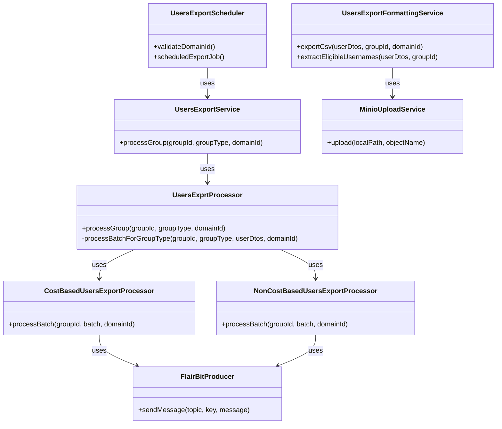
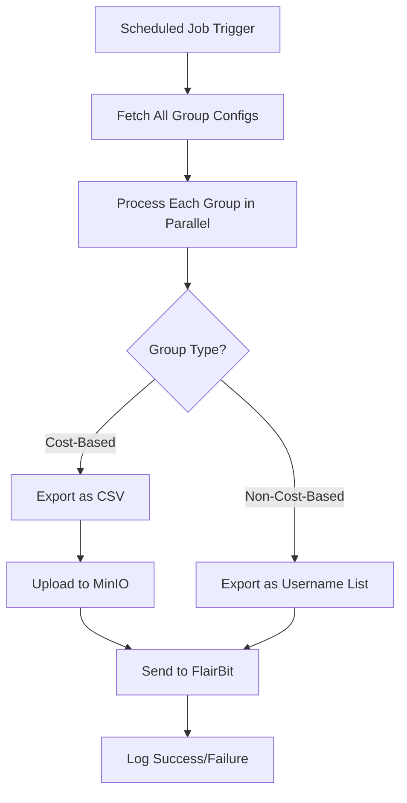
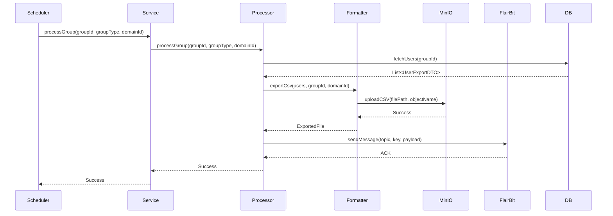
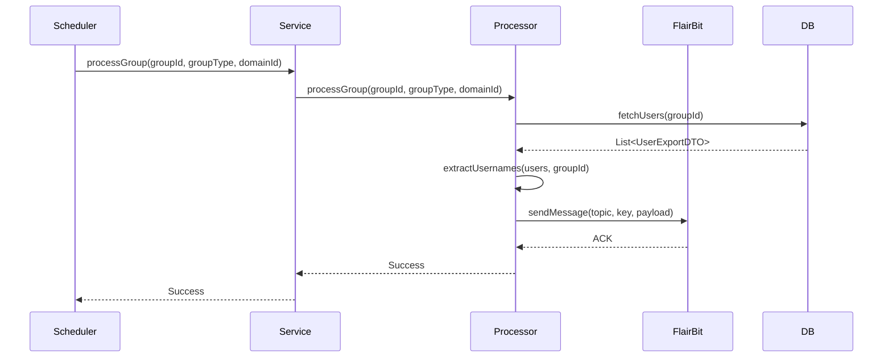
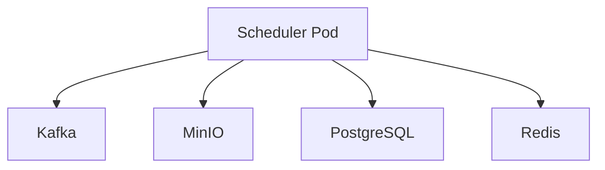

# **Low-Level Design (LLD) for User Export Module**

---

## **1. Overview**
The **User Export Module** is responsible for **exporting user profiles** in bulk to an external system (FlairBit) for matching purposes. It supports **two types of exports**:
1. **Cost-Based Export** (CSV format)
2. **Non-Cost-Based Export** (Username list)

The module runs as a **scheduled job** (daily at 11:20 PM IST) and processes users in **batches** for efficiency.

---

## **2. System Components**

### **2.1. Class Diagram**


---

## **3. Key Workflows**

### **3.1. Scheduled Export Flow**


### **3.2. Cost-Based Export Sequence**


### **3.3. Non-Cost-Based Export Sequence**


---

## **4. Detailed Component Design**

### **4.1. `UsersExportScheduler`**
- **Purpose**: Triggers the export job daily at **11:20 PM IST**.
- **Key Methods**:
    - `validateDomainId()`: Validates `domainId` is a valid UUID.
    - `scheduledExportJob()`: Fetches all group configs and processes them in parallel.

```java
@Scheduled(cron = "0 20 23 * * *", zone = "Asia/Kolkata")
public void scheduledExportJob() {
    List<MatchingGroupConfig> groupConfigs = groupConfigRepository.findAll();
    CompletableFuture<?>[] futures = groupConfigs.stream()
            .map(config -> usersExportService.processGroup(config.getId(), config.getType(), UUID.fromString(domainId)))
            .toArray(CompletableFuture[]::new);
    CompletableFuture.allOf(futures).join();
}
```

### **4.2. `UsersExportService`**
- **Purpose**: Orchestrates the export process for each group.
- **Key Methods**:
    - `processGroup()`: Processes a group asynchronously with retries.

```java
@Async("usersExportExecutor")
public CompletableFuture<Void> processGroup(String groupId, String groupType, UUID domainId) {
    return retryTemplate.execute(context -> {
        usersExportProcessor.processGroup(groupId, groupType, domainId);
        return CompletableFuture.completedFuture(null);
    });
}
```

### **4.3. `UsersExprtProcessor`**
- **Purpose**: Fetches users and delegates to the appropriate processor.
- **Key Methods**:
    - `processGroup()`: Fetches users and processes them in batches.
    - `processBatchForGroupType()`: Routes to `CostBased` or `NonCostBased` processor.

```java
public void processGroup(String groupId, String groupType, UUID domainId) {
    List<UserExportDTO> users = userRepository.findByGroupIdAndSentToMatchingServiceFalse(groupId);
    CompletableFuture<Void> future = processBatchForGroupType(groupId, groupType, users, domainId);
    future.join();
}
```

### **4.4. `CostBasedUsersExportProcessor`**
- **Purpose**: Exports users as a **CSV file** and uploads to **MinIO**.
- **Key Methods**:
    - `processBatch()`: Converts users to CSV, uploads to MinIO, and sends to FlairBit.

```java
public CompletableFuture<Void> processBatch(String groupId, List<UserExportDTO> batch, UUID domainId) {
    return usersExportFormattingService.exportCsv(batch, groupId, domainId)
            .thenCompose(file -> {
                NodeExchange payload = RequestMakerUtility.buildCostBasedNodes(groupId, file.filePath(), file.fileName(), file.contentType(), domainId);
                flairBitProducer.sendMessage(USERS_EXPORT, domainId + "-" + groupId, BasicUtility.stringifyObject(payload));
                return CompletableFuture.completedFuture(null);
            });
}
```

### **4.5. `NonCostBasedUsersExportProcessor`**
- **Purpose**: Exports usernames as a **list** and sends directly to FlairBit.
- **Key Methods**:
    - `processBatch()`: Extracts usernames and sends to FlairBit.

```java
public CompletableFuture<Void> processBatch(String groupId, List<UserExportDTO> batch, UUID domainId) {
    List<String> usernames = userExportService.extractEligibleUsernames(batch, groupId);
    NodeExchange payload = RequestMakerUtility.buildNonCostBasedNodesPayload(groupId, usernames, domainId);
    flairBitProducer.sendMessage(USERS_EXPORT, domainId + "-" + groupId, BasicUtility.stringifyObject(payload));
    return CompletableFuture.completedFuture(null);
}
```

### **4.6. `UsersExportFormattingService`**
- **Purpose**: Formats user data into **CSV** or extracts **usernames**.
- **Key Methods**:
    - `exportCsv()`: Generates a CSV file and uploads to MinIO.
    - `extractEligibleUsernames()`: Extracts usernames from `UserExportDTO`.

```java
public CompletableFuture<ExportedFile> exportCsv(List<UserExportDTO> userDtos, String groupId, UUID domainId) {
    return CompletableFuture.supplyAsync(() -> {
        Path filePath = createFilePath(groupId, domainId);
        try (Writer writer = new OutputStreamWriter(new GZIPOutputStream(Files.newOutputStream(filePath)))) {
            CSVWriter csvWriter = new CSVWriter(writer);
            // Write CSV headers and rows
            minioUploadService.upload(filePath.toString(), objectName);
            return new ExportedFile(filePath, fileName, "application/gzip", groupId, domainId, remoteUrl);
        }
    }, exportExecutor);
}
```

### **4.7. `MinioUploadService`**
- **Purpose**: Uploads files to **MinIO** (S3-compatible storage).
- **Key Methods**:
    - `upload()`: Uploads a local file to MinIO.

```java
public void upload(String localPath, String objectName) {
    minioClient.uploadObject(
            UploadObjectArgs.builder()
                    .bucket(bucketName)
                    .object(objectName)
                    .filename(localPath)
                    .build()
    );
}
```

### **4.8. `FlairBitProducer`**
- **Purpose**: Sends export payloads to **FlairBit** (Kafka-based).
- **Key Methods**:
    - `sendMessage()`: Publishes a message to a Kafka topic.

```java
public void sendMessage(String topic, String key, String message) {
    kafkaTemplate.send(topic, key, message);
}
```

---

## **5. Data Models**

### **5.1. `UserExportDTO`**
Represents a user to be exported.
```java
public record UserExportDTO(
    String username,
    String groupId,
    String displayName,
    String gender,
    LocalDate dateOfBirth,
    String location,
    String intent,
    String bio,
    Boolean smokes,
    Boolean drinks,
    Boolean wantsKids,
    String education,
    String religion,
    String occupation,
    String preferredGenders,
    Integer preferredMinAge,
    Integer preferredMaxAge,
    String relationshipType,
    Boolean openToLongDistance,
    Boolean readyForMatching
) {}
```

### **5.2. `ExportedFile`**
Represents a successfully exported file.
```java
public record ExportedFile(
    Path localPath,
    String fileName,
    String contentType,
    String groupId,
    UUID domainId,
    String remoteUrl
) {}
```

### **5.3. `NodeExchange` (FlairBit Payload)**
Represents the payload sent to FlairBit.
```java
public record NodeExchange(
    String groupId,
    String filePath,
    String fileName,
    String contentType,
    UUID domainId,
    List<String> usernames
) {}
```

---

## **6. Error Handling & Retries**

### **6.1. Retry Mechanism**
- Uses `RetryTemplate` to retry failed operations (3 attempts by default).
- Logs failures and increments metrics.

```java
retryTemplate.execute(context -> {
    usersExportProcessor.processGroup(groupId, groupType, domainId);
    return null;
});
```

### **6.2. Exception Handling**
| **Exception**               | **Handling**                                                                 |
|-----------------------------|-----------------------------------------------------------------------------|
| `BadRequestException`       | Logs error, skips processing.                                               |
| `InternalServerError`       | Retries, then logs failure.                                                 |
| `IOException`               | Retries, then marks as failed.                                              |
| `KafkaException`            | Retries, then logs and increments failure metric.                          |

---

## **7. Metrics & Monitoring**
Uses **Micrometer** to track:
- **Export Duration** (`users_export_duration`)
- **Batch Processing Time** (`users_export_batch_duration`)
- **Failures** (`users_export_failures`)
- **CSV Export Success** (`users_export_csv_processed`)

```java
meterRegistry.timer("users_export_duration", "groupId", groupId, "groupType", groupType)
        .record(durationMs, TimeUnit.MILLISECONDS);
```

---

## **8. Threading & Concurrency**
- Uses `@Async` for parallel group processing.
- `ThreadPoolTaskExecutor` for CSV generation.
- `CompletableFuture` for non-blocking operations.

```java
@Async("usersExportExecutor")
public CompletableFuture<Void> processGroup(...) { ... }
```

---

## **9. File Handling**
- **CSV Generation**:
    - Uses `opencsv` for CSV writing.
    - Compresses with `GZIPOutputStream`.
- **Temporary Files**:
    - Stored in `/tmp/flairbit-exports/{domainId}/{groupId}/`.
    - Automatically cleaned up after upload.

```java
Path filePath = Paths.get(System.getProperty("java.io.tmpdir"), "flairbit-exports", domainId.toString(), groupId);
Files.createDirectories(filePath);
```

---

## **10. Integration Points**

| **System**         | **Integration Method**       | **Purpose**                          |
|--------------------|-----------------------------|--------------------------------------|
| **FlairBit**       | Kafka Producer              | Send user data for matching.         |
| **MinIO**          | MinIO Java SDK              | Store exported CSV files.           |
| **PostgreSQL**     | Spring Data JPA             | Fetch users to export.               |
| **Redis**          | Spring Cache                | Cache group configs.                 |

---

## **11. Performance Considerations**

| **Optimization**               | **Implementation**                                                                 |
|--------------------------------|-----------------------------------------------------------------------------------|
| **Parallel Processing**        | Processes groups in parallel using `CompletableFuture`.                          |
| **Batching**                   | Processes users in batches (`batchSize=1000`).                                   |
| **Asynchronous I/O**           | Uses `CompletableFuture` for non-blocking file uploads.                         |
| **Caching**                    | Caches group configs to reduce DB load.                                          |
| **Compression**                | Uses GZIP to reduce CSV file size.                                               |
| **Retry Mechanism**            | Retries failed operations (DB queries, Kafka sends).                            |

---

## **12. Security Considerations**

| **Aspect**          | **Implementation**                                                                 |
|---------------------|-----------------------------------------------------------------------------------|
| **Authentication**   | Not applicable (internal job).                                                   |
| **Authorization**   | Only runs in non-test environments (`@Profile("!test")`).                        |
| **Data Encryption** | Files stored in MinIO with access controls.                                     |
| **Audit Logging**   | Logs all export operations with timestamps.                                     |
| **Input Validation**| Validates `domainId` is a UUID, checks for empty batches.                        |

---

## **13. Failure Scenarios & Recovery**

| **Scenario**                     | **Recovery Mechanism**                                                                 |
|----------------------------------|---------------------------------------------------------------------------------------|
| **DB Query Failure**             | Retries 3 times, then logs and skips.                                                |
| **CSV Generation Failure**      | Retries, then marks batch as failed.                                                 |
| **MinIO Upload Failure**         | Retries, then logs and increments failure metric.                                   |
| **Kafka Send Failure**           | Retries, then logs and increments failure metric.                                   |
| **Empty Batch**                  | Logs and skips processing.                                                            |
| **Invalid Group Type**           | Logs warning and skips.                                                               |

---

## **14. Deployment & Scaling**

### **14.1. Deployment Architecture**


### **14.2. Scaling Strategy**
| **Component**      | **Scaling Approach**                          |
|--------------------|-----------------------------------------------|
| **Scheduler**      | Horizontal scaling (multiple pods).           |
| **Database**       | Read replicas for `userRepository` queries.  |
| **MinIO**          | Distributed storage with multiple nodes.     |
| **Kafka**          | Partitioned topics for parallel consumption. |

---

## **15. Future Enhancements**

🔹 **Incremental Exports** – Only export changed users since last run.
🔹 **Dynamic Batch Sizing** – Adjust batch size based on system load.
🔹 **Export Resumption** – Resume failed exports from last checkpoint.
🔹 **Multi-Format Support** – Add JSON/Parquet export options.
🔹 **Real-Time Export Triggers** – Export users immediately when marked as `ready_for_matching`.

---

### **Key Takeaways**
- **Asynchronous & Non-Blocking**: Uses `CompletableFuture` and `@Async`.
- **Retry Mechanism**: Ensures reliability with `RetryTemplate`.
- **Modular Design**: Separates concerns (scheduling, processing, formatting).
- **Observability**: Tracks metrics for performance monitoring.
- **Scalable**: Designed for horizontal scaling.

---


