# Low-Level Design (LLD) for Users Export Module

---

## Table of Contents
1. [Overview](#-overview)
2. [Sequence Diagrams](#-sequence-diagrams)
    - Scheduled Export Trigger
    - Cost-Based Group Processing
    - Non-Cost-Based Group Processing
3. [Class Diagram](#-class-diagram)
4. [Component Responsibilities](#-component-responsibilities)
5. [Error Handling & Observability](#-error-handling--observability)
6. [Concurrency & Async Flow](#-concurrency--async-flow)
7. [Configuration & Tuning](#-configuration--tuning)
8. [Assumptions & Limitations](#-assumptions--limitations)

---

## 1. Overview

The **Users Export Module** is responsible for periodically exporting user data grouped by matching configurations to an external system via Kafka (FlairBit). The export is scheduled daily at 11:20 PM IST and processes all active groups in parallel.

Key characteristics:
- **Batched processing** (configurable size, default=1000)
- **Async execution** using `@Async` executor
- **Retry support** via Spring RetryTemplate
- **Metrics instrumentation** with Micrometer (`MeterRegistry`)
- **Conditional activation** — disabled in test profile
- **Two export strategies**: Cost-Based (CSV upload to MinIO + metadata Kafka message) and Non-Cost-Based (username list via Kafka)

---

## 2. Sequence Diagrams

### A. Scheduled Export Trigger


> *All group exports are processed concurrently via CompletableFuture. Errors are logged but do not halt other exports.*

---

### B. Cost-Based Group Processing

```mermaid
sequenceDiagram
    participant Processor as UsersExprtProcessor
    participant CostProcessor as CostBasedUsersExportProcessor
    participant FormattingService as UsersExportFormattingService
    participant Minio as MinioUploadService
    participant Kafka as FlairBitProducer

    Processor->>CostProcessor: processBatch(groupId, users, domainId)
    activate CostProcessor
    CostProcessor->>FormattingService: exportCsv(users, groupId, domainId)
    activate FormattingService
    FormattingService->>FormattingService: filter + map to UserView
    FormattingService->>FormattingService: create temp file path
    FormattingService->>FormattingService: write CSV + GZIP
    FormattingService->>Minio: upload(localPath, objectName)
    activate Minio
    Minio->>Minio: check bucket exists → create if needed
    Minio->>Minio: uploadObject(...)
    Minio-->>FormattingService: void
    deactivate Minio
    FormattingService-->>CostProcessor: ExportedFile
    deactivate FormattingService
    CostProcessor->>Kafka: sendMessage(topic, key, payload)
    activate Kafka
    Kafka->>Kafka: kafkaTemplate.send(...)
    Kafka->>Kafka: async callback on success/failure
    Kafka->>Kafka: sendToDlq(...) if failed
    Kafka-->>CostProcessor: void
    deactivate Kafka
    CostProcessor-->>Processor: CompletableFuture<Void>
    deactivate CostProcessor
```



>  *Entire CSV generation and upload is async and retried. Kafka send is fire-and-forget with DLQ fallback.*

---

### C. Non-Cost-Based Group Processing


>  *No file upload involved. Only usernames are extracted and sent directly via Kafka.*

---

## 3. Class Diagram


---

## 4. Component Responsibilities

| Component | Responsibility |
|----------|----------------|
| `UsersExportScheduler` | Triggers daily export job. Validates domain UUID. Fetches all group configs and schedules async exports. |
| `UsersExportService` | Async entry point. Wraps processor in retry and metrics. Returns `CompletableFuture`. |
| `UsersExprtProcessor` | Orchestrates export per group. Fetches raw user data, transforms to DTO, delegates to correct processor. |
| `CostBasedUsersExportProcessor` | Generates gzipped CSV, uploads to MinIO, sends metadata payload to Kafka. |
| `NonCostBasedUsersExportProcessor` | Extracts distinct usernames and sends directly to Kafka. |
| `UsersExportFormattingService` | Interface for CSV generation and username extraction. Implemented by formatting service. |
| `UsersExportFormattingServiceImpl` | Implements CSV writing, GZIP compression, local temp file creation, MinIO upload. |
| `MinioUploadService` | Handles MinIO bucket existence check and file upload. |
| `FlairBitProducer` | Asynchronously sends messages to Kafka with DLQ fallback on failure. |

---

## ⚠️ 5. Error Handling & Observability

### Success Metrics
- `users_export_duration{groupId, groupType}` — Duration of entire group export.
- `users_export_group_duration{groupId, groupType}` — Time inside processor.
- `users_export_batch_duration{groupId}` — Time to format/upload/send batch.
- `users_export_csv_duration{groupId}` — Time to generate and upload CSV.
- `users_export_batch_processed{groupId}` — Counter of users exported per batch.
- `users_export_csv_processed{groupId}` — Counter of users written to CSV.

### Failure Metrics
- `users_export_failures{groupId, groupType}` — Export failed at service level.
- `users_export_batch_failures{groupId, groupType}` — Batch-level failure.
- `users_export_csv_failures{groupId}` — CSV generation/upload failed.
- `users_export_invalid_group_type{groupId, groupType}` — Unknown group type.

### Logging
- INFO: Start/end of group/batch processing, upload success, Kafka send success.
- WARN: Unknown group type.
- ERROR: Any exception during export, Kafka send failure, CSV generation error.

### Retry
- Wrapped around `usersExportProcessor.processGroup(...)` and `minioUpload`/`csv generation`.
- Uses Spring `RetryTemplate` — configurable externally.

### DLQ
- If Kafka send fails → message is resent to `flairbit-dlq` topic asynchronously.

---

## 6. Concurrency & Async Flow

- **Top-level concurrency**: All groups are exported in parallel via `CompletableFuture[]` + `allOf().join()`.
- **Per-group async**: `UsersExportService.processGroup()` is `@Async("usersExportExecutor")`.
- **CSV generation async**: `exportCsv()` uses `CompletableFuture.supplyAsync(..., exportExecutor)`.
- **Kafka send async**: Uses `whenCompleteAsync(..., kafkaCallbackExecutor)` for callbacks.
- **No blocking joins except at scheduler level** — ensures scalability.

> ⚠️ Potential Bottleneck: If `usersExportExecutor` thread pool is exhausted, exports may queue or timeout. Monitor pool size vs number of groups.

---

## 7. Configuration & Tuning

### Application Properties (Expected)

```properties
# Domain validation
domain-id=xxxxxxxx-xxxx-xxxx-xxxx-xxxxxxxxxxxx

# Export settings
export.batch-size=1000
export.base-dir=https://minio.example.com
export.minio.bucket=flairbit-exports

# Scheduler cron (default: daily 11:20 PM IST)
# Overridable via @Scheduled(cron=...) or property

# Thread pools (must be defined in configuration)
# - usersExportExecutor
# - kafkaCallbackExecutor
```

### External Dependencies
- **MinIO**: Bucket must allow uploads. Network access from app.
- **Kafka**: Topic `flairbit-users` and `flairbit-dlq` must exist.
- **Database**: Efficient index on `(group_id, sent_to_matching_service)` for `UserRepository`.

---

## 🧪 8. Assumptions & Limitations

### Assumptions
- `domainId` is a valid UUID (validated at startup).
- Group types are either `COST_BASED` or `NON_COST_BASED` (case-insensitive).
- `UserRepository.findByGroupIdAndSentToMatchingServiceFalse` returns manageable dataset (< few 100K per group).
- Underlying executors (`usersExportExecutor`, `kafkaCallbackExecutor`) are properly configured with sufficient threads.
- MinIO and Kafka are highly available.

### Limitations / Risks
- **Memory Pressure**: Large groups may cause OOM during CSV generation if batch size is too high.
- **No Backpressure**: Scheduler triggers regardless of previous run completion. Could overlap if export > 24h.
- **No Idempotency**: Re-running same group may re-export same users unless `sent_to_matching_service` flag updated elsewhere.
- **DLQ Not Guaranteed**: If Kafka is down entirely, DLQ send also fails — loss possible.
- **Hardcoded Topics**: `"flairbit-users"` and `"flairbit-dlq"` are hardcoded — not configurable.

### Future Improvements
- Make Kafka topics configurable.
- Add circuit breaker for Kafka/MinIO.
- Update `sent_to_matching_service` flag after successful export.
- Add exponential backoff to retry.
- Support pagination for very large groups.

---

