# 📄 **Low-Level Design (LLD): Users Export Module**

---


```markdown
# Users Export Module – Low-Level Design (LLD)

## 1.  Overview

The **Users Export Module** periodically exports eligible users from the dating platform to downstream systems (e.g., FlairBit matching engine). It supports two types of export logic:

- **Cost-Based**: Full CSV export with enriched profile data (name, bio, preferences, etc.)
- **Non-Cost-Based**: Lightweight export of only usernames (reference IDs)

Exports are scheduled daily, processed asynchronously per group, and sent via message queue after CSV generation and upload to MinIO.

---

## 2. System Components

### 🔹 `UsersExportScheduler` (Scheduler)
- Triggers daily export job at `23:20 IST`
- Fetches all active `MatchingGroupConfig`s
- Launches async processing for each group
- Uses `CompletableFuture.allOf().join()` to wait

### 🔹 `UsersExportService` (Orchestrator)
- Async service (`@Async`)
- Wraps processing in retry logic
- Measures metrics via `MeterRegistry`
- Returns `CompletableFuture<Void>`

### 🔹 `UsersExprtProcessor` (Batch Fetcher)
- Fetches users via raw SQL from `userRepository`
- Transforms to `UserExportDTO`
- Delegates to appropriate processor by group type

### 🔹 `CostBasedUsersExportProcessor`
- Generates **CSV.gz** file with full user details
- Uploads to MinIO via `MinioUploadService`
- Sends message to Kafka/RabbitMQ with file URL

### 🔹 `NonCostBasedUsersExportProcessor`
- Extracts only `username` list
- Sends directly as payload in message (no file)

### 🔹 `UsersExportFormattingService`
- Handles CSV formatting using `CsvExporter`
- Defines field mappings via `UserFieldsExtractor`
- Uploads to MinIO

### 🔹 `MinioUploadService`
- Uploads generated CSV files to object storage (MinIO/S3)

### 🔹 `FlairBitProducer`
- Sends messages to external system (e.g., Kafka topic `flairbit-users`)

---

## 3. Data Flow


---

## 4. Class Diagram (Simplified)


---

## 5. Sequence Diagram: Cost-Based Export

```mermaid
sequenceDiagram
    participant Scheduler
    participant Service
    participant Processor
    participant FormatSvc
    participant MinIO
    participant Producer
    participant Downstream

    Scheduler->>Service: processGroup("grp1", "COST_BASED", domainId)
    Service->>Processor: processGroup("grp1", ...)
    Processor->>DB: findByGroupIdAndSentToMatchingServiceFalse
    DB-->>Processor: Raw Object[] list
    Processor->>Processor: transformToUserExportDTO()
    Processor->>FormatSvc: exportCsv(batch, "grp1", domainId)
    FormatSvc->>FormatSvc: createFilePath()
    FormatSvc->>FormatSvc: Write CSV + GZIP
    FormatSvc->>MinIO: upload(tempFile, s3://bucket/domain/grp1/file.csv.gz)
    MinIO-->>FormatSvc: OK
    FormatSvc-->>Processor: ExportedFile{url}
    Processor->>Producer: buildCostBasedNodes(...) → sendMessage()
    Producer->>Downstream: Kafka: { "fileUrl": "...", "type": "COST_BASED" }
    Downstream-->>MatchingEngine: Start processing
```



---

## 6. Sequence Diagram: Non-Cost-Based Export


---

## 7. 🗃️ Key Data Structures

### `UserExportDTO` (Immutable Record)
```java
record UserExportDTO(
    UUID userId,
    String username,
    String displayName,
    String gender,
    LocalDate dob,
    String city,
    String bio,
    Boolean smokes,
    Boolean drinks,
    Set<String> preferredGenders,
    Integer minAge, Integer maxAge,
    String relationshipType,
    Boolean wantsKids,
    Boolean openToLongDistance,
    String intent,
    Boolean readyForMatching,
    String groupId
) {}
```

### `ExportedFile`
```java
record ExportedFile(
    Path localPath,
    String fileName,
    String contentType,
    String groupId,
    UUID domainId,
    String remoteUrl
) {}
```

### `NodeExchange` (Message Payload)
```json
{
  "groupId": "dating-default",
  "domainId": "a1b2c3d4-...",
  "type": "USER",
  "payload": {
    "fileUrl": "https://exports.example.com/...",
    "contentType": "application/gzip"
  }
}
```

---

## 8. Core Design Patterns

| Pattern | Usage |
|-------|-------|
| **Strategy Pattern** | Different export logic for `COST_BASED` vs `NON_COST_BASED` |
| **Async Processing** | `@Async("usersExportExecutor")` for parallel group exports |
| **Retry Mechanism** | `RetryTemplate` around CSV generation and message sending |
| **Functional Field Mapping** | `CsvExporter.FieldExtractor<T>` for clean, extensible CSV headers |
| **Utility Classes** | `UserFieldsExtractor`, `HeaderNormalizer`, `CsvExporter` for reusability |
| **Synchronized Temp File Creation** | Thread-safe `createFilePath()` to avoid conflicts |

---

## 9. Configuration & Properties

```properties
# Application Properties
domain-id=a1b2c3d4-e5f6-7890-g1h2-i3j4k5l6m7n8
export.batch-size=1000
export.base-dir=https://s3.example.com/flairbit-exports
export.minio.bucket=flairbit-exports

minio.bucket-name=flairbit-exports

# Cron Schedule (IST)
0 20 23 * * *   # Every day at 23:20 IST
```

---

## 10. Fault Tolerance & Resilience

| Feature | Implementation |
|--------|----------------|
| **Retry on Failure** | `RetryTemplate` for CSV write and message send |
| **Error Handling** | `.exceptionally()` in `CompletableFuture` |
| **Async Isolation** | Dedicated thread pool: `usersExportExecutor` |
| **Partial Success** | One group fails → others continue |
| **Logging** | Structured logs with group ID, duration, error context |
| **Metrics** | Micrometer timers and counters by `groupId`, `groupType` |

---

## 11. Observability

### Metrics (Micrometer)
| Metric | Tags | Purpose |
|------|------|--------|
| `users_export_duration` | `groupId`, `groupType` | End-to-end group processing time |
| `users_export_batch_duration` | `groupId` | Batch processing latency |
| `users_export_csv_duration` | `groupId` | CSV generation time |
| `users_export_failures` | `groupId`, `groupType` | Alert on failure |
| `users_export_batch_processed` | `groupId` | Count exported users |
| `users_export_csv_processed` | `groupId` | Track CSV records |

### Logs
- INFO: Job start/end, file upload, message sent
- DEBUG: Fetched user count
- ERROR: Export failure with stack trace

---

## 12. Edge Cases & Validation

| Case | Handling |
|-----|---------|
| Invalid `domain-id` | `@PostConstruct` validates UUID format |
| Empty batch | Skip export gracefully |
| Unknown group type | Log warning, skip |
| MinIO upload failure | Retry → fail export |
| Kafka send failure | Retry → log error, increment counter |
| Duplicate `sent_to_matching_service` users | DB query filters them out |

---

## 13. Testing Strategy

| Test Type | Focus |
|--------|-------|
| Unit Tests | `CsvExporter`, `UserFieldsExtractor`, `HeaderNormalizer` |
| Integration Tests | DB query → CSV generation → MinIO upload |
| Mock Tests | `FlairBitProducer`, `MinioUploadService` |
| Retry Simulation | Force failure → verify retry behavior |
| Async Behavior | Verify thread pool usage |

---

## 14. Future Improvements

| Enhancement | Benefit |
|-----------|--------|
| Dynamic cron via config | Change schedule without redeploy |
| Export history tracking | Audit what was sent when |
| Retry with backoff | Exponential backoff in `RetryTemplate` |
| ZIP compression | Save bandwidth |
| GCP/Azure Storage Support | Multi-cloud |
| Webhook Callback | Notify external system when done |
| CSV Schema Versioning | Avoid breaking changes |

---

## Summary

This module enables **reliable, scalable, and type-aware user exports** for downstream matching engines. It balances performance, observability, and resilience while cleanly separating concerns.

It is production-ready and aligns with enterprise integration patterns.

---
```

---

## Diagrams (Render in Mermaid-Compatible Viewer)

You can paste these into [Mermaid Live Editor](https://mermaid.live/edit) or embed in Markdown.

### 1. **Data Flow Diagram**


---

